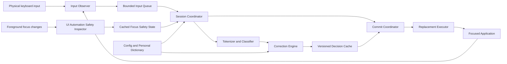
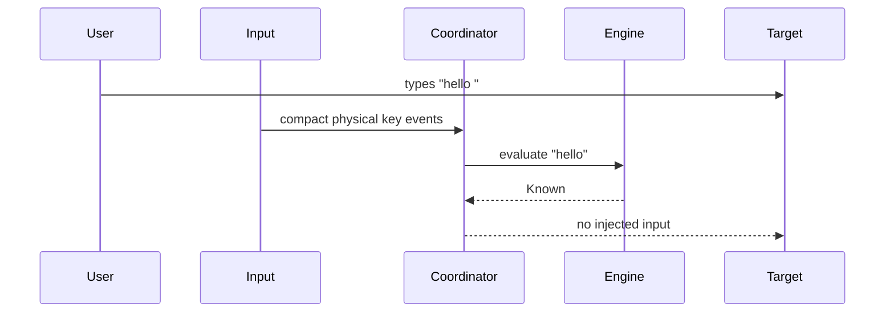
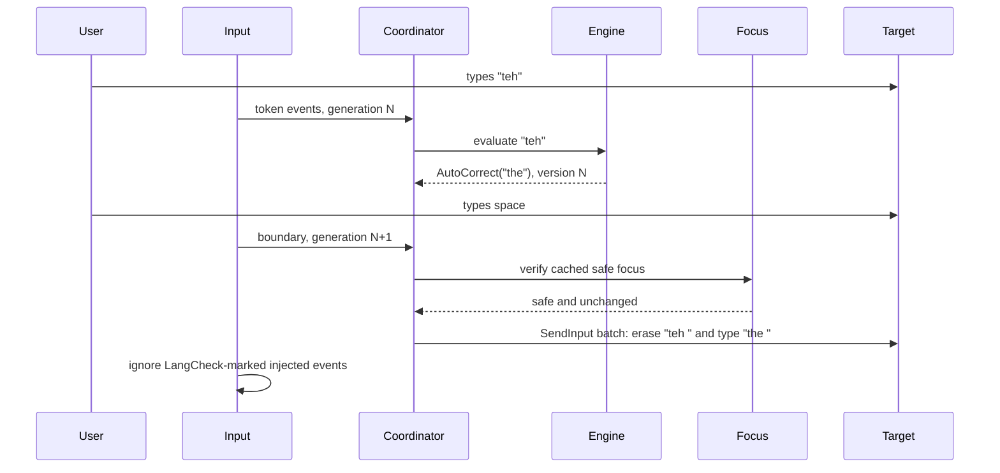
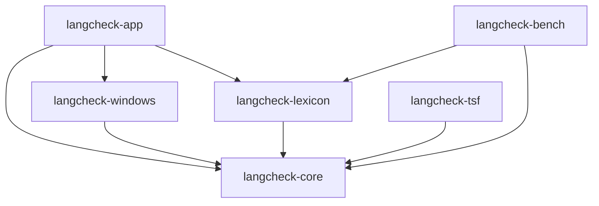
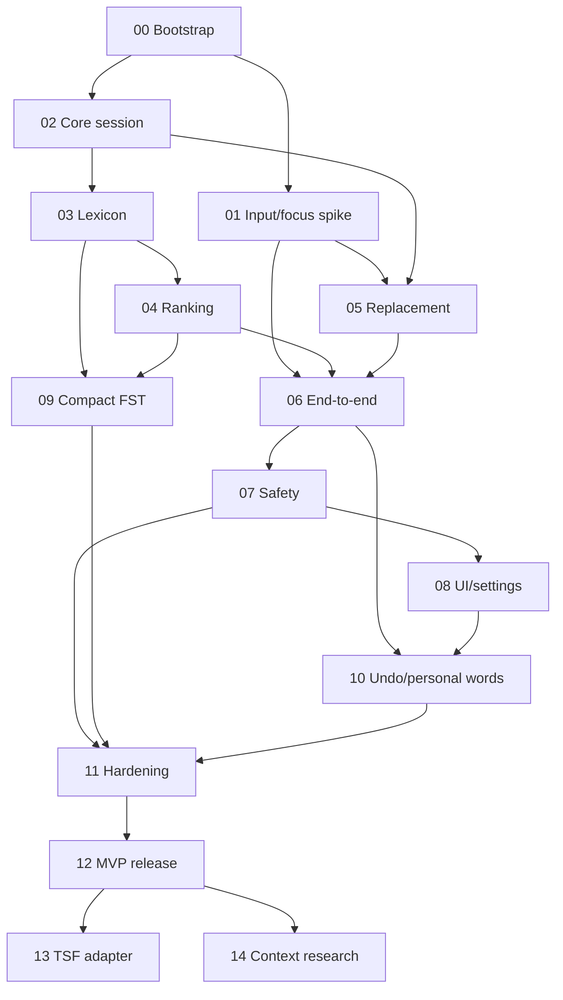

# LangCheck Software Blueprint

> A Windows-first, local-only, ultra-fast spelling checker that observes typing,
> detects likely misspellings, and applies only high-confidence corrections with
> an immediate undo path.

| Field | Value |
|---|---|
| Document status | Proposed implementation blueprint |
| Working product name | LangCheck |
| Initial platform | Windows 11 and Windows 10 x64 desktop |
| Initial language | English (`en-US`) |
| Implementation language | Rust |
| User interface | Native Win32 tray and settings UI |
| Network capability | None; inbound and outbound networking are prohibited |
| Last updated | 2026-06-04 |

## 1. Executive Summary

LangCheck will be a small per-user Windows desktop application that runs in the
background, observes physical keyboard input only while focus is positively
classified as a safe prose field, builds only the word currently being typed,
and autocorrects a misspelling after a safe word boundary such as a space.

The application will be optimized for:

- Very low idle memory and CPU use.
- Sub-10-millisecond spelling decisions on the normal path.
- No network capability, cloud dependency, telemetry, or transmission of typed
  text, history, diagnostics, settings, or identifiers.
- Conservative autocorrection that prefers missing a correction over making a
  harmful one.
- Immediate undo when an automatic correction is unwanted.
- Clear exclusions for passwords, terminals, code editors, elevated
  applications, secure desktops, and unknown text controls.

The first production architecture will use one small Rust process containing a
native tray UI, input observer, focus safety inspector, correction engine, and
replacement executor. It will not run as a Windows service and will not require
administrator privileges.

Microsoft Text Services Framework (TSF) integration is a later precision
adapter. A TSF text service can edit text ranges more accurately in compatible
applications, but it is a COM component loaded into other processes. It must
remain a small, separately tested adapter and must not contain the correction
engine.

### 1.1 Non-Negotiable Invariants

1. **Fully local:** LangCheck has no inbound or outbound networking, telemetry,
   cloud sync, crash upload, remote diagnostics, update check, or in-app
   download.
2. **No typing history:** LangCheck never persists a history of typed words,
   sentences, fields, applications, or corrections. It stores only settings and
   personal dictionary/rule entries the user explicitly approves.
3. **Sensitive fields are inactive:** Password, PIN/OTP, authentication,
   payment, financial, recovery-code, private-key, security-answer, non-prose,
   and unknown fields are not queued, translated, buffered, checked, logged, or
   modified.
4. **Background operation is user-controlled:** LangCheck runs in the
   background with a tray icon and provides a per-user `Start with Windows`
   option. Explicit Exit stops it; closing settings does not.
5. **No security bypass:** LangCheck never elevates itself, bypasses UIPI, or
   runs as a Windows service.

## 2. Product Definition

### 2.1 Problem

Users make frequent spelling mistakes while typing across desktop applications.
Existing tools may use substantial memory, require cloud processing, or add
noticeable latency. LangCheck should provide a fast and private autocorrect
experience with a small resource footprint.

### 2.2 Primary User

A Windows user who types ordinary English prose in applications such as:

- Notepad and other standard text editors.
- Browser text boxes and text areas.
- Chat and email applications.
- Document editors that accept normal keyboard input.

### 2.3 Core User Promise

When LangCheck is enabled, common high-confidence spelling mistakes are
corrected quickly after the user finishes the word. The application never sends
typed text, history, diagnostics, settings, identifiers, or any other data
anywhere. It does not retain typing history, avoids sensitive fields, and lets
the user immediately undo a correction.

### 2.4 Definition of “System-Wide”

“System-wide” means best-effort support across normal desktop text controls in
the current user session. It does **not** mean universal access to every field.

LangCheck must intentionally avoid or may be unable to modify:

- Password and protected text fields.
- PIN, one-time-password, payment, financial, authentication, recovery-code,
  private-key, security-answer, and other known sensitive fields.
- UAC prompts and the secure desktop.
- Applications running at a higher integrity level than LangCheck.
- Remote desktop or virtual-machine input when safety cannot be established.
- IME composition, dead-key composition, and unsupported keyboard layouts in
  the English MVP.
- Applications that do not expose enough focus or field metadata.
- Applications explicitly excluded by the user or by a default safety profile.

## 3. Goals and Non-Goals

### 3.1 MVP Goals

1. Correct common English misspellings in supported text fields.
2. Run entirely on the local computer.
3. Use no more than the defined memory and latency budgets.
4. Avoid password fields and uncertain contexts.
5. Support pause, per-application exclusions, personal words, and immediate
   undo.
6. Start automatically after user sign-in when enabled.
7. Install and uninstall without administrator privileges.
8. Produce deterministic, testable correction decisions.
9. Run quietly in the background with a native tray icon and explicit controls.

### 3.2 Post-MVP Goals

1. Add a TSF precision adapter for compatible applications.
2. Support additional language packs.
3. Add an optional compact local context model.
4. Offer suggestion-only mode and a lightweight candidate popup.
5. Support ARM64 Windows.

### 3.3 Non-Goals for MVP

- Full grammar rewriting comparable to a cloud language model.
- Style, tone, plagiarism, or generative writing features.
- Mobile, macOS, or Linux support.
- Correction inside password managers, terminals, IDE code editors, or secure
  fields by default.
- Reading whole documents or retaining sentence history.
- Bypassing Windows integrity boundaries or security controls.
- Cloud accounts, synchronization, analytics, or advertising.
- Any networking, telemetry, crash upload, remote diagnostics, update check, or
  in-app download.

## 4. Product Principles

1. **Fail closed in uncertain fields.** Unknown safety state means no
   autocorrection.
2. **Never block the keyboard hook with real work.** Input callbacks copy a
   small event and return immediately.
3. **Do not collect full text.** Retain only the active token and, when the user
   explicitly enables a future context mode, a very small bounded context
   window in volatile memory. Clear it on focus change and never persist it.
4. **Do not use the clipboard for replacement.** Clipboard mutation is
   surprising, unsafe, and can leak data.
5. **Do not autocorrect low-confidence candidates.** Suggestion-only or no
   action is preferable.
6. **Make every correction reversible.** Immediate undo must be fast and
   reliable.
7. **Measure resource use continuously.** Performance budgets are release
   requirements, not aspirations.
8. **Keep native integration separate from language logic.** The correction
   engine must be testable without Windows APIs.
9. **Remain physically offline.** The application must contain no networking
   feature, telemetry client, cloud sync, crash uploader, update checker, remote
   diagnostics, or network-capable plugin system.

## 5. Success Metrics and Budgets

All measurements use an optimized release build with the English MVP enabled.
Exact budgets may be tightened after the feasibility spike, but they may not be
relaxed without an Architecture Decision Record (ADR).

| Metric | MVP target | Release ceiling |
|---|---:|---:|
| Idle CPU after 60 seconds | `< 0.1%` average | `< 0.3%` average |
| Idle working set | `< 25 MB` | `< 35 MB` |
| Private bytes | `< 35 MB` | `< 50 MB` |
| Input callback duration, p99 | `< 100 microseconds` | `< 250 microseconds` |
| Engine decision latency, p50 | `< 2 ms` | `< 4 ms` |
| Engine decision latency, p95 | `< 5 ms` | `< 10 ms` |
| Engine decision latency, p99 | `< 10 ms` | `< 20 ms` |
| Replacement dispatch after boundary, p95 | `< 10 ms` | `< 20 ms` |
| Idle wakeups | `< 2 per second` | `< 5 per second` |
| Cold startup to ready | `< 500 ms` | `< 1 second` |
| Installed size, English only | `< 20 MB` | `< 35 MB` |
| Crash-free supported typing sessions | `>= 99.95%` | `>= 99.9%` |
| Harmful autocorrection rate in evaluation corpus | `< 0.1%` | `< 0.25%` |

### 5.1 Quality Metrics

- Precision is more important than recall for automatic correction.
- Automatic correction precision target: at least `99.5%` on the curated
  evaluation corpus.
- Suggestion recall is measured separately and must not lower autocorrection
  precision.
- Every reported incorrect autocorrection becomes a regression test.

## 6. Supported Behavior

### 6.1 Default Correction Flow

1. The user types a normal English word.
2. LangCheck observes key events and maintains the current token in memory.
3. The correction engine computes a decision outside the input callback.
4. The user types a safe boundary, initially space or selected punctuation.
5. LangCheck verifies that:
   - The field is safe and editable.
   - Focus has not changed.
   - No newer physical input invalidated the decision.
   - The correction is above the automatic threshold.
6. LangCheck atomically injects backspaces plus the corrected word and original
   boundary.
7. LangCheck records only a short-lived undo transaction.
8. If the user immediately presses Backspace, LangCheck restores the original
   word and temporarily suppresses that correction pair.

### 6.2 Correction Modes

| Mode | Behavior |
|---|---|
| Off | Observe nothing and perform no correction. |
| Conservative autocorrect | Apply only high-confidence corrections. Default. |
| Suggest only | Detect mistakes but never replace automatically. Post-MVP UI. |
| App paused | Disabled for the focused application. |
| Global pause | Disabled until resumed or pause timer expires. |

### 6.3 Initial Safe Boundaries

The MVP may autocorrect after:

- Space.
- Period, comma, question mark, exclamation mark, colon, or semicolon when the
  foreground field and token state remain unchanged.

The MVP must not autocorrect after:

- Enter or Tab, because focus or application state may change.
- A click, selection change, paste, undo, or navigation key.
- A boundary produced while Control, Alt, or Windows modifiers are active.
- A boundary during IME or dead-key composition.

### 6.4 Tokens Eligible for Automatic Correction

Initial automatic correction is limited to conservative English tokens:

- ASCII letters with an optional internal apostrophe.
- Between 3 and 32 characters.
- Not all uppercase.
- Not mixed case or camelCase unless explicitly learned.
- No digits, underscores, slashes, backslashes, `@`, `#`, or URL-like syntax.
- Not classified as an email address, hostname, path, command, code token, or
  identifier.

Other tokens may be checked in future suggestion-only modes but must not be
automatically changed in the MVP.

## 7. High-Level Architecture



### 7.1 Process Topology

#### MVP

One per-user process:

`langcheck.exe`

Responsibilities:

- Run continuously in the background for the signed-in user.
- Native tray icon and settings window.
- Dedicated input observer thread and message loop.
- Dedicated focus-inspection COM thread.
- Session coordinator and correction engine.
- Replacement executor.
- Configuration and personal dictionary persistence.

The MVP must not:

- Install a Windows service.
- Request administrator privileges.
- inject a DLL into arbitrary applications.
- start a general-purpose async runtime when bounded threads and message loops
  are sufficient.

Only one broker instance may run per user session. A second launch must signal
the existing instance to open settings and then exit.

#### Post-MVP TSF Topology

- `langcheck.exe`: trusted broker and correction engine.
- `langcheck_tsf.dll`: minimal signed in-process COM text service.
- A local-only same-user named pipe with a strict ACL and remote-client
  rejection connects the TSF adapter to the broker.

The TSF adapter must contain no dictionary, ranking model, persistence, network
logic, or settings UI. A failure in the adapter must fail open and leave the
host application's typing unchanged.

## 8. Core Components and Functions

### 8.1 Input Observer

Purpose:

- Receive keyboard input events without performing language work.
- Identify and ignore events injected by LangCheck.
- Discard events immediately when an atomic `capture_allowed` safety flag is
  false.
- Assign a monotonically increasing generation number to physical input.
- Push compact events into a bounded queue.

Preferred MVP mechanism:

- Start with a `WH_KEYBOARD_LL` feasibility implementation on a dedicated
  thread with a Windows message loop.
- During the feasibility spike, benchmark Raw Input as an observation
  alternative because Microsoft recommends it for asynchronous monitoring in
  many cases.
- Select the mechanism that provides the required coverage while meeting the
  callback and correctness budgets.

Hard requirements:

- No allocation in the callback.
- No logging in the callback.
- No COM, UI Automation, dictionary, filesystem, or locking calls in the
  callback.
- Do not queue or translate key events unless `capture_allowed` is true.
- If the queue is full, drop the event, increment a counter, reset the active
  token, and return. Never block.
- Pass unrelated events through immediately.

Example interface:

```rust
pub trait InputObserver {
    fn start(&mut self, sink: InputEventSink) -> Result<(), InputError>;
    fn stop(&mut self);
}

pub struct InputEvent {
    pub generation: u64,
    pub timestamp_ms: u64,
    pub kind: InputEventKind,
    pub virtual_key: u16,
    pub scan_code: u16,
    pub flags: u32,
}
```

### 8.2 Focus Safety Inspector

Purpose:

- Track the focused control and foreground process.
- Determine whether autocorrection is safe for the current field.
- Positively classify a field as a normal prose field before enabling capture.
- Cache a compact `FocusContext` for the hot path.

Primary APIs:

- UI Automation focus-changed events.
- UI Automation control properties, including password status and read-only
  state.
- Foreground window and process metadata.
- Windows integrity-level checks.

Rules:

- Run all UI Automation calls on a dedicated COM thread.
- Never make UI Automation calls from the input callback.
- Treat timeout, missing provider data, provider failure, or stale focus as
  unsafe.
- Never query the value of a password field.
- Do not read the full value of normal text controls.
- Set `capture_allowed` to false immediately on focus uncertainty, navigation,
  mouse focus changes, or inspector failure.
- Revalidate focus before replacement.

Example type:

```rust
pub struct FocusContext {
    pub focus_id: u64,
    pub hwnd: isize,
    pub process_id: u32,
    pub process_name_hash: u64,
    pub editable: bool,
    pub password: bool,
    pub read_only: bool,
    pub elevated_above_us: bool,
    pub sensitivity: FieldSensitivity,
    pub capture_allowed: bool,
    pub app_policy: AppPolicy,
    pub observed_at_ms: u64,
}
```

### 8.3 Session Coordinator

Purpose:

- Convert input events into a small, versioned typing session.
- Reset safely on focus changes, navigation, paste, modifiers, or unknown
  events.
- Request correction decisions outside the input callback.
- Permit replacement only when the decision matches the current session.

State:

- Current focus ID.
- Current physical-input generation.
- Current token, capped at 32 characters for MVP.
- Original casing classification.
- Last safe boundary.
- Latest correction decision and its token version.
- Optional undo transaction.

Session reset triggers:

- Focus change.
- Queue overflow or dropped event.
- Mouse click or selection movement.
- Arrow, Home, End, Page Up, Page Down, Delete, Enter, or Tab.
- Clipboard paste or cut shortcuts.
- Unknown key translation state.
- IME or composition activity.
- Global or per-app pause.

### 8.4 Tokenizer and Token Classifier

Purpose:

- Convert translated characters into candidate words.
- Classify tokens before any dictionary work.
- Restore casing after a candidate is chosen.

Functions:

```rust
pub fn push_char(state: &mut TokenState, ch: char) -> TokenUpdate;
pub fn finish_token(state: &mut TokenState, boundary: Boundary) -> WordSnapshot;
pub fn classify_token(token: &str) -> TokenClass;
pub fn normalize_lookup(token: &str) -> NormalizedToken;
pub fn restore_case(original: &str, replacement: &str) -> Option<String>;
```

Token classes include:

- `NaturalWord`
- `KnownPersonalWord`
- `EmailOrUrl`
- `Path`
- `CodeOrIdentifier`
- `NumericOrMixed`
- `UnsupportedUnicode`
- `TooShort`
- `TooLong`

The MVP must only automatically correct `NaturalWord`.

### 8.5 Lexicon Provider

Purpose:

- Check whether a normalized word is known.
- Generate bounded candidate suggestions.
- Keep the correction engine independent from a specific dictionary backend.

```rust
pub trait LexiconProvider: Send + Sync {
    fn contains(&self, language: LanguageTag, word: &str) -> bool;
    fn candidates(
        &self,
        language: LanguageTag,
        word: &str,
        limit: usize,
    ) -> SmallVec<[LexiconCandidate; 8]>;
}
```

#### Production Backend: Compact FST Lexicon

The release application uses LangCheck's own bundled, read-only local lexicon.
It must not send words to a system, third-party, or remote spell provider.

Design:

- Compile an approved English word list and frequency data into a read-only
  finite-state transducer (FST).
- Memory-map the FST instead of deserializing it into a large heap structure.
- Use bounded edit-distance search to generate candidates.
- Re-rank candidates with keyboard proximity, frequency, casing, and learned
  rules.

Advantages:

- Deterministic performance and behavior.
- Compact memory-mapped representation.
- Cross-platform reusable core.

Constraints:

- Dictionary source and redistribution license require explicit approval.
- English morphology and proper-noun coverage require evaluation.
- Dictionary compiler output must be reproducible and versioned.

#### Rejected Runtime Backend: Windows Spell Checking API

The Windows Spell Checking API is not used by release builds. It may load
external spell-check providers selected outside LangCheck's control. Even if
the API itself is local, LangCheck cannot guarantee that every external provider
is offline. That uncertainty conflicts with the hard guarantee that typed words
never leave the device.

It may be evaluated only in an isolated developer benchmark that never ships
with the application and never processes real user typing.

#### Hunspell Decision

Hunspell dictionaries may be used as an **offline build-time source** for a
compiled lexicon if their licenses permit it. The resident application must not
embed or call a Hunspell runtime.

### 8.6 Candidate Generator

Purpose:

- Produce a small bounded set of plausible corrections.

Initial candidate sources:

1. Explicit user autocorrect pairs.
2. Built-in high-confidence common typo rules.
3. Lexicon suggestions within a maximum edit distance.
4. Keyboard-adjacent substitution variants.
5. Transposition, insertion, deletion, and repeated-letter variants.

Bounds:

- At most 32 generated candidates before ranking.
- At most 8 candidates returned by a lexicon backend.
- Maximum edit distance:
  - `1` for tokens of length 3 to 5.
  - `2` for tokens of length 6 or more.
- A strict per-request deadline. Timeout produces no correction.

### 8.7 Ranker and Confidence Policy

Purpose:

- Rank plausible candidates.
- Separate “best suggestion” from “safe to autocorrect.”

Candidate score inputs:

- Weighted edit distance.
- Adjacent-key substitution cost.
- Word frequency.
- Difference from the second-best candidate.
- Original casing compatibility.
- User-added words and blocked correction pairs.
- Optional short context, disabled in MVP until privacy and quality gates pass.

Illustrative scoring model:

```text
score =
    edit_cost
  + keyboard_distance_penalty
  + casing_penalty
  + rare_word_penalty
  - explicit_rule_bonus
  - user_preference_bonus
  - context_bonus
```

Autocorrect is allowed only when all conditions pass:

- Original token is not already known.
- Candidate is a known word.
- Token class is `NaturalWord`.
- Top candidate is below the maximum score.
- Top candidate beats the second candidate by the minimum margin.
- Field safety state is current and safe.
- Candidate does not change capitalization unexpectedly.
- Pair is not blocked globally, for the current app, or for the current session.
- Decision completed before its deadline.

Decision kinds:

```rust
pub enum CorrectionDecision {
    Known,
    Ignore(IgnoreReason),
    Suggest(Candidate),
    AutoCorrect(Candidate),
}
```

### 8.8 Decision Cache

Purpose:

- Keep a completed decision associated with the exact token and input
  generation.
- Allow a boundary event to commit an already-computed decision without doing
  language work in the input callback.

Every decision must contain:

- Focus ID.
- Token version.
- Physical-input generation.
- Normalized original word.
- Replacement.
- Confidence and decision reason.
- Expiration timestamp.

Stale decisions are discarded.

### 8.9 Commit Coordinator

Purpose:

- Perform final safety checks before changing text.
- Cancel when any state has changed.
- Create the replacement and undo transactions.

Commit checks:

1. LangCheck remains enabled.
2. Focus ID, foreground window, and process are unchanged.
3. Focus safety state is fresh.
4. Physical-input generation equals the decision generation plus the expected
   boundary event.
5. The boundary is allowed.
6. No correction is already in progress.
7. Replacement plan is ASCII-safe for MVP.
8. Target integrity level is not higher than LangCheck.

If any check fails, do nothing.

### 8.10 Replacement Executor

Purpose:

- Apply a correction without using the clipboard.
- Ignore its own injected input.
- Produce a short-lived undo transaction.

MVP replacement:

- Use one `SendInput` batch containing:
  - Backspaces for the original token and boundary.
  - Unicode input for the corrected token.
  - The original boundary.
- Add a LangCheck-specific marker in `dwExtraInfo`.
- Ignore marked and injected events in the observer.
- Verify that `SendInput` reports the expected number of inserted events.
- Never retry blindly after a partial or failed insertion.

Windows User Interface Privilege Isolation (UIPI) allows input injection only
into applications at an equal or lower integrity level. LangCheck must detect
and skip higher-integrity targets; it must never attempt to bypass UIPI.

```rust
pub struct ReplacementPlan {
    pub focus_id: u64,
    pub expected_generation: u64,
    pub original: String,
    pub replacement: String,
    pub boundary: Boundary,
}

pub trait ReplacementExecutor {
    fn execute(&mut self, plan: &ReplacementPlan) -> Result<UndoTransaction, ReplaceError>;
}
```

### 8.11 Undo Manager

Purpose:

- Reverse the most recent automatic correction when the user immediately
  rejects it.

Initial behavior:

- If Backspace is the first relevant physical input within two seconds after an
  autocorrection, restore the original token and boundary state.
- Add the correction pair to a session blocklist.
- Repeated undo of the same pair can offer to block it permanently.
- Any unrelated typing, focus change, navigation, or timeout clears the undo
  transaction.

Undo must use the same final safety checks as correction.

### 8.12 Personal Dictionary and Rules

Features:

- Add a word.
- Remove a personal word.
- Always replace one word with another.
- Never replace a specific pair.
- Exclude an application.

Persistence must be local, small, and human-inspectable:

- `user_words.txt`: one normalized UTF-8 word per line.
- `autocorrect.tsv`: original, replacement, and optional app scope.
- `blocked_pairs.tsv`: original, candidate, and optional app scope.
- `excluded_apps.toml`: process identity rules.

These files contain only settings or entries the user explicitly adds or
approves. LangCheck must not build or persist a history of words, sentences,
applications typed in, corrections encountered, or field contents.

Files must be rewritten atomically using a temporary file and replacement.
Malformed lines are skipped and reported without preventing startup.

### 8.13 Configuration Manager

Responsibilities:

- Load defaults, persisted settings, and app policies.
- Validate and migrate configuration versions.
- Apply changes without restarting when safe.
- Persist via atomic replacement.

Example configuration:

```toml
schema_version = 1
enabled = true
mode = "conservative"
language = "en-US"
start_at_login = false
launch_in_background = true
undo_window_ms = 2000
diagnostics = false

[performance]
decision_deadline_ms = 15
max_token_chars = 32

[privacy]
context_mode = false
retain_typing_history = false
```

`retain_typing_history` is a documented invariant and must remain `false`; it is
not a user-configurable feature.

## 9. Threading and Concurrency Model

The MVP should use a small fixed number of threads:

| Thread | Responsibility |
|---|---|
| Main/UI | Tray icon, settings window, lifecycle commands |
| Input | Keyboard observation and Windows message loop |
| Coordinator | Token state, engine decisions, commit, replacement |
| Focus inspector | UI Automation and foreground safety metadata |

Guidelines:

- Avoid a general async runtime in the resident application.
- Use bounded queues only.
- Prefer single-writer ownership for session state.
- Keep queues small enough that stale typing work is dropped rather than
  accumulated.
- Set explicit thread stack sizes only after stress testing establishes a safe
  lower bound.
- Never hold a lock while calling COM, UI Automation, `SendInput`, or the
  filesystem.
- A queue overflow invalidates the session and disables correction until the
  next clean token.

## 10. Detailed Event Flow

### 10.1 Normal Word



### 10.2 Automatic Correction



### 10.3 Cancelled Correction

If the user types another physical key, focus changes, or the safety state
expires before replacement begins, the commit is cancelled. LangCheck must not
try to “catch up” later.

## 11. Native Windows Integration

### 11.1 Keyboard Observation

Feasibility must compare:

- `WH_KEYBOARD_LL`: supports low-level keyboard observation and injected-event
  flags, but its callback must return quickly and can be silently removed after
  a timeout.
- Raw Input: suitable for asynchronous observation and recommended by Microsoft
  in many monitoring scenarios, but requires validation for text translation,
  injected-event handling, and app coverage.

The selected observer must be documented in an ADR after measurements.

### 11.2 Character Translation

The MVP supports ordinary English Latin input only.

- Translate virtual keys outside the input callback.
- Maintain keyboard state carefully.
- Reset and skip on dead keys, IME composition, unsupported layouts, or
  uncertain translation.
- Do not assume that every key-down event produces one character.
- Do not autocorrect pasted text in the MVP.

### 11.3 UI Automation

Use UI Automation only for focus and safety metadata, not for per-character
typing.

Reasons:

- UI Automation calls cross process boundaries.
- `TextPattern` exposes text and selection but does not generally provide a
  direct text insertion API.
- `ValuePattern` may replace a whole field and is unsafe for routine
  autocorrection.
- Providers vary in quality and can be slow or unavailable.

### 11.4 Text Services Framework

TSF is the preferred future precision adapter for compatible applications
because it provides document contexts, edit sessions, ranges, and text service
integration.

TSF phase requirements:

- Implement a minimal COM text service adapter.
- Use TSF edit sessions and range replacement rather than simulated backspaces.
- Detect composition and input scopes.
- Communicate with the broker over same-user IPC.
- Keep host-process work bounded and fail open.
- Sign and register the text service correctly.
- Maintain a kill switch that disables the adapter without uninstalling the
  broker.

TSF is not required to prove the MVP correction engine.

## 12. Privacy, Security, and Safety

### 12.1 Privacy Guarantees

- No inbound or outbound network functionality in any release.
- No typed text, history, settings, diagnostics, identifiers, or usage metrics
  leave the computer.
- No telemetry, analytics, crash upload, cloud sync, remote logging, update
  check, or in-app download.
- No full-field or full-document collection.
- No clipboard access.
- No raw token text in normal logs.
- No typing history is persisted. Only explicit personal words, explicit
  replacement rules, explicit blocked pairs, and settings may be stored.
- Any future context mode is opt-in, bounded, memory-only, cleared on focus
  change, and never persisted or transmitted.
- A user can delete all LangCheck state from settings.

These guarantees are release-blocking invariants. A feature that requires
networking or retained typing history must be rejected rather than added behind
a setting.

### 12.2 Sensitive Field Policy

Autocorrection is disabled when:

- UI Automation reports a password field.
- The field is identified as a PIN, OTP, authentication, payment, financial,
  recovery-code, private-key, security-answer, or other sensitive input.
- The field is read-only or not editable.
- Focus metadata is missing, stale, or timed out.
- The foreground app is a password manager, terminal, remote-control tool, or
  other default-excluded category.
- The target application has a higher integrity level.
- The desktop is secure or the session is locked.
- The app is excluded by the user.

The application must not query text values from password or sensitive fields.
Attempting to read protected values is a security defect. If LangCheck cannot
determine whether a field is sensitive, it must classify the field as unsafe
and do nothing.

Capture uses a positive allow policy:

- `capture_allowed` starts as false and becomes true only for a field positively
  classified as `NormalProse`.
- Field classifications are `NormalProse`, `Sensitive`, `NonProse`, and
  `Unknown`.
- `Sensitive`, `NonProse`, and `Unknown` fields do not queue, translate, buffer,
  check, log, or replace typing.
- A focus change clears the token and sets `capture_allowed` to false before the
  new field is inspected.
- Generic browser and custom application fields remain disabled when their
  purpose cannot be established safely.
- A future local browser safety adapter may classify HTML field semantics, but
  it must request no network permissions and communicate only through
  local-only same-user IPC.

### 12.3 Threat Model

Threats:

- Accidental capture of secrets.
- Accidental persistence or transmission of typing history.
- Incorrect replacement in a sensitive or destructive field.
- Infinite recursion from observing injected replacement events.
- Malicious or broken UI Automation providers causing hangs.
- Tampered dictionaries or update packages.
- A compromised same-user process sending commands to a future TSF adapter.
- A bug in an in-process TSF adapter crashing a host application.

Mitigations:

- Fail-closed focus safety state.
- No networking code path and no persisted typing history.
- Dedicated UI Automation thread and bounded operations.
- Strict event markers and injected-event filtering.
- Same-user IPC ACL plus message validation.
- Signed release artifacts.
- Dictionary hashes and version validation.
- Minimal TSF adapter with no unsafe language logic.
- Bounded token lengths, candidate counts, queue sizes, and deadlines.
- No elevation and no UIPI bypass.

### 12.4 Unsafe Rust Policy

- Safe Rust is the default.
- Windows FFI requires small, reviewed `unsafe` boundaries.
- Every `unsafe` block must include a succinct safety invariant comment.
- FFI wrappers own handle lifetime and convert Win32 errors into typed errors.
- `cargo miri` should run on platform-independent unsafe helpers where
  applicable.

## 13. User Interface

### 13.1 Tray Menu

Initial native tray menu:

- Status: Enabled, Paused, or Unsafe Field.
- Enable/disable LangCheck.
- Pause for 15 minutes, 1 hour, or until resumed.
- Pause for the current application.
- Open settings.
- Open personal dictionary.
- Exit.

### 13.2 Settings Window

Use native Win32 controls through `windows-rs`. Do not use Electron, WebView, or
a browser-based UI.

Pages:

1. General: enabled, start at login, language, mode.
2. Applications: default exclusions and user exclusions.
3. Personal dictionary: added words, forced replacements, blocked pairs.
4. Privacy: offline guarantees, local stored data, and delete all state.
5. Diagnostics: version, resource snapshot, export redacted diagnostics.

### 13.3 Accessibility

- All controls must have accessible names and keyboard navigation.
- High-contrast themes and system font scaling must work.
- The app must not interfere with screen readers.
- The tray and settings UI must remain usable while correction is paused.

### 13.4 Background and Start-at-Login Behavior

- LangCheck runs as a per-user background process with a visible tray icon.
- Closing the settings window returns to background operation; it does not exit
  the application.
- The tray menu contains an explicit `Exit LangCheck` action.
- The General settings page contains a `Start LangCheck when I sign in` toggle.
- Start-at-login is off by default until the user or installer explicitly
  enables it.
- When enabled, register a quoted per-user launch command under
  `HKCU\Software\Microsoft\Windows\CurrentVersion\Run`.
- Startup launches `langcheck.exe --background`, without opening the settings
  window.
- Disabling start-at-login removes only LangCheck's own registration.
- Uninstall always removes the startup registration.
- A per-user single-instance mutex prevents duplicate background processes.
- A normal second launch tells the existing background process to open settings.
- LangCheck never uses a Windows service, scheduled watchdog, administrator
  privilege, or hidden second process to remain running.

## 14. Storage Layout

Per-user application data:

```text
%LOCALAPPDATA%\LangCheck\
  config.toml
  state\
    user_words.txt
    autocorrect.tsv
    blocked_pairs.tsv
    excluded_apps.toml
  dictionaries\
    en-US.fst
    en-US.meta.json
  logs\
    diagnostics.log        # only when diagnostics is enabled
```

Per-user installation:

```text
%LOCALAPPDATA%\Programs\LangCheck\
  langcheck.exe
  langcheck_tsf.dll        # post-MVP only
  licenses\
```

Rules:

- Inherit user-only ACLs.
- Validate schema versions and file sizes before reading.
- Cap every persisted file.
- Write state atomically.
- Never store a stream of typed words.
- Diagnostic export must be redacted and user initiated.
- Diagnostic export writes only to a user-selected local file. LangCheck never
  uploads or transmits it.

## 15. Proposed Rust Workspace

```text
langcheck/
  Cargo.toml
  Cargo.lock
  rust-toolchain.toml
  README.md
  blueprint.md
  LICENSE
  SECURITY.md
  docs/
    adr/
    compatibility.md
    privacy.md
  crates/
    langcheck-core/
      src/
        token.rs
        classify.rs
        candidate.rs
        rank.rs
        confidence.rs
        session.rs
        undo.rs
    langcheck-lexicon/
      src/
        lib.rs
        windows_spell.rs
        compact_fst.rs
        personal.rs
    langcheck-windows/
      src/
        input/
        focus/
        replace/
        tray/
        startup/
        integrity.rs
    langcheck-app/
      src/
        main.rs
        coordinator.rs
        config.rs
        persistence.rs
        diagnostics.rs
    langcheck-tsf/
      src/                    # post-MVP
    langcheck-bench/
      benches/
  tools/
    dictionary-compiler/
  tests/
    corpora/
    windows-harness/
  packaging/
    installer/
  .github/
    workflows/
```

### 15.1 Dependency Direction



`langcheck-core` must not depend on Windows APIs, UI frameworks, filesystem
layout, or a concrete lexicon backend.

## 16. Dependency Policy

Preferred dependency categories:

- `windows` / `windows-core` for Windows APIs.
- `serde` and a small TOML implementation for configuration.
- `smallvec` or fixed-capacity structures for bounded hot-path collections.
- `fst` and `memmap2` only if the compact lexicon backend passes the benchmark
  and licensing gate.
- A small bounded channel or ring-buffer implementation.

Avoid unless justified by an ADR:

- Electron, WebView, Chromium, or Node.js.
- Tokio or another large async runtime in the resident process.
- A large GUI framework.
- An embedded database for the small MVP state model.
- Large machine-learning runtimes.

Prohibited:

- Dependencies that perform network calls or telemetry.
- Network-capable plugin systems.
- Crash upload, remote logging, analytics, cloud sync, or update clients.

Networking and telemetry dependencies are prohibited, not merely discouraged.
The release dependency review must reject crates or native libraries that add
network clients, crash uploaders, remote logging, analytics, cloud sync, update
checks, or network-capable plugin systems.

Every release dependency must:

- Have a compatible license.
- Pass vulnerability and supply-chain checks.
- Be pinned through `Cargo.lock`.
- Have a documented purpose.
- Be removed when its purpose no longer exists.

## 17. Error Handling and Failure Behavior

| Failure | Required behavior |
|---|---|
| Input queue full | Drop event, reset token, increment redacted counter |
| UI Automation timeout | Mark focus unsafe; do not correct |
| Lexicon timeout/error | Do not correct; keep typing unaffected |
| Stale correction decision | Discard |
| Focus changed before commit | Cancel |
| Higher-integrity target | Skip |
| Partial or failed `SendInput` | Clear session and undo state; do not retry blindly |
| Invalid configuration | Use safe defaults and report locally |
| Corrupt personal dictionary line | Skip line and continue |
| Dictionary hash/version mismatch | Disable that backend and fall back safely |
| TSF adapter unavailable | Continue with broker behavior or remain disabled |
| Panic on worker thread | Disable correction, preserve tray UI, report redacted fault |

The input observer must always prefer normal user input over correction.

## 18. Observability

### 18.1 Default Metrics

Keep only bounded in-memory counters:

- Input events seen and dropped.
- Session resets by reason.
- Tokens classified by category.
- Known, ignored, suggested, and corrected decision counts.
- Decision latency histogram.
- Replacement successes and failures.
- Focus safety rejection counts.

No counter may include raw typed text. Counters are discarded when LangCheck
exits and are never transmitted.

### 18.2 Diagnostics Mode

Diagnostics mode is user enabled and time bounded.

Allowed:

- Component state.
- Error codes.
- Timing and memory measurements.
- Process names only when the user explicitly exports diagnostics.
- Hashes and versions of dictionaries and binaries.

Disallowed:

- Passwords.
- Raw field contents.
- Streams of typed tokens.
- Clipboard content.
- Network upload or remote diagnostics.

## 19. Testing Strategy

### 19.1 Unit Tests

Required areas:

- Tokenization and reset behavior.
- Token classification.
- Case restoration.
- Edit-distance and candidate ranking.
- Confidence thresholds.
- App policy resolution.
- Configuration parsing and migration.
- Personal dictionary atomic persistence.
- Undo state machine.
- Event generation/version invalidation.

### 19.2 Property and Fuzz Tests

- Tokenizer never exceeds configured bounds.
- Arbitrary Unicode input never panics.
- Candidate generation remains bounded.
- Malformed config and dictionary files fail safely.
- Replacement plan creation never emits a plan for an unsupported token.
- Session state resets correctly under arbitrary event sequences.

### 19.3 Corpus Tests

Maintain versioned corpora:

- Common misspelling pairs.
- Correct uncommon words that must not be changed.
- Names, acronyms, URLs, paths, emails, and code identifiers.
- Ambiguous errors where autocorrection must not occur.
- Regressions for every reported harmful correction.

Outputs:

- Precision and recall by decision tier.
- Top false positives.
- Latency distribution.
- Result differences between lexicon backends.

### 19.4 Windows Integration Harness

Build controlled test applications containing:

- Win32 Edit controls.
- Rich Edit controls.
- Password controls.
- Read-only controls.
- Controls in an elevated process.
- Focus-changing and slow UI Automation providers.
- Fields that simulate rapid typing and paste.

Release compatibility matrix should also cover representative applications:

- Notepad.
- A Chromium-based browser text area.
- Microsoft Edge text area.
- A document editor.
- A chat-style text field.
- Windows Terminal and a code editor, where correction must be disabled by
  default.

### 19.5 Performance Tests

Measure:

- Callback duration without allocations.
- Queue throughput and overflow behavior.
- Engine latency over the corpus.
- Cold and warm lexicon lookup.
- Idle CPU, wakeups, working set, and private bytes.
- Rapid typing at and above 200 words per minute.
- Focus-switch storms.
- Long-running stability for at least 8 hours.

Release performance tests must run on both a normal development machine and a
defined low-spec Windows test machine.

### 19.6 Security Tests

- No action in password fields.
- No action in PIN, OTP, authentication, payment, financial, recovery-code,
  private-key, security-answer, or unknown sensitive fields.
- No key event is queued, translated, or buffered while focus is sensitive,
  non-prose, or unknown.
- No action on the secure desktop.
- No action in higher-integrity processes.
- No recursion from injected events.
- No clipboard access.
- No raw token text in default logs.
- No typing-history persistence.
- No socket, HTTP, telemetry, crash-upload, update-check, remote-log, or other
  network behavior.
- State files reject oversized or malformed input.
- Future named-pipe clients are authenticated as the current user.

## 20. CI and Release Gates

Every pull request:

1. `cargo fmt --check`
2. `cargo clippy --workspace --all-targets -- -D warnings`
3. `cargo test --workspace`
4. Platform-independent fuzz/property smoke tests
5. Windows x64 release build
6. Dependency license and vulnerability checks

Before an internal release:

1. Windows integration harness passes.
2. Corpus precision gate passes.
3. Performance ceilings pass.
4. Password, integrity, and injection-loop safety tests pass.
5. Installer install, upgrade, and uninstall tests pass.
6. Offline-invariant audit confirms no networking dependency or behavior.

Before a public release:

1. Binaries and installer are code signed.
2. SBOM and third-party license notices are generated.
3. Dictionary source and redistribution license are approved.
4. Privacy and security documentation are current.
5. Rollback package is available.
6. Offline-invariant and no-typing-history audits pass.

## 21. Packaging and Lifecycle

### 21.1 Installer

- Per-user installation by default.
- No administrator privileges.
- Optional start-at-login registration.
- Background launch uses `--background` and does not open settings.
- Installer and uninstaller add or remove only LangCheck's per-user startup
  registration.
- Clean uninstaller that removes binaries and startup registration.
- User state is retained on uninstall only after asking; otherwise it is
  removed.

### 21.2 Updates

LangCheck performs no update checks and contains no in-app updater. New versions
are distributed as signed installers that the user obtains and runs outside
LangCheck. The application must never contact a release server, fetch release
notes, download a package, or report the installed version.

### 21.3 Crash Recovery

- On restart, correction begins disabled until input and focus state are clean.
- Never replay a pending correction after a crash.
- Detect repeated startup crashes and offer safe mode with input observation
  disabled.

## 22. Compatibility Policy

Compatibility levels:

| Level | Meaning |
|---|---|
| Supported | Automated tests pass and autocorrection is enabled by default. |
| Suggestion only | Detection may work, but replacement is not considered safe. |
| Disabled by default | Application category is sensitive or destructive. |
| Unsupported | Platform or field cannot be handled safely. |

The compatibility matrix lives in `docs/compatibility.md` and records:

- Application and control type.
- Input observer behavior.
- Focus safety support.
- Replacement support.
- Known limitations.
- Required default policy.

## 23. Architecture Decisions

### ADR-001: Rust as the Primary Language

Decision:

- Use Rust for the broker, correction engine, Windows integration, tools, and
  future TSF adapter unless a narrow C++ bridge is proven necessary.

Reason:

- Native performance, low memory, strong safety, and reusable core logic.

### ADR-002: Conservative Post-Boundary Replacement

Decision:

- The MVP allows the user's boundary to reach the target, then applies an
  atomic `SendInput` replacement only if no newer input or focus change has
  occurred.

Reason:

- Avoid blocking or suppressing normal keyboard input while language work runs.

### ADR-003: UI Automation Is a Safety Signal, Not an Editing API

Decision:

- Use UI Automation for focus metadata and protected-field detection. Do not use
  it to routinely replace field contents.

Reason:

- UI Automation providers vary, calls cross processes, and `TextPattern` does
  not generally insert text.

### ADR-004: Bundled Offline Compact Lexicon

Decision:

- Use a bundled, read-only, memory-mapped compact FST lexicon in release builds.
- Do not call Windows or third-party spell-check providers at runtime.

Reason:

- LangCheck must control the full typed-word processing path to guarantee that
  nothing is transmitted. The compact FST also provides deterministic latency
  and memory behavior.

### ADR-005: TSF After MVP

Decision:

- Add TSF only after the correction engine, safety model, and replacement
  behavior are proven.

Reason:

- A TSF text service is powerful but adds COM registration, host-process risk,
  and a much larger compatibility test surface.

### ADR-006: No Full Grammar Engine in MVP

Decision:

- Restrict MVP to spelling and explicit replacement rules.

Reason:

- High-quality grammar correction requires substantially more context, memory,
  compute, and privacy design.

## 24. Delivery Plan

Each step is sized for one focused pull request. A fresh engineer or coding
agent should be able to execute a step from its context brief without reading
the implementation history. Steps may be split if their acceptance criteria
cannot fit safely in one pull request.

### Step 00: Repository Bootstrap and Guardrails

**Context brief:** The workspace is empty. Establish a Rust workspace and the
quality gates that every later step will rely on. Do not implement keyboard
observation or autocorrection yet.

**Scope:**

- Initialize Git and the Rust workspace.
- Add the crate skeleton from Section 15, excluding post-MVP crates if desired.
- Pin the Rust toolchain.
- Add formatting, linting, testing, dependency-audit, and Windows build CI.
- Add `README.md`, `LICENSE`, `SECURITY.md`, and the ADR directory.

**Acceptance criteria:**

- Clean checkout builds and tests on Windows x64.
- CI runs the pull-request gates from Section 20.
- `langcheck-core` has no Windows dependencies.
- Empty release executable starts and exits cleanly.

**Dependencies:** None.

**Rollback:** Revert the bootstrap PR; no user state or compatibility impact.

### Step 01: Windows Input and Focus Feasibility Spike

**Context brief:** Before building the product, prove that normal typing can be
observed cheaply and that sensitive fields can be identified reliably enough to
fail closed. This is a measurement spike, not a production autocorrect loop.

**Scope:**

- Prototype `WH_KEYBOARD_LL` on a dedicated thread.
- Prototype Raw Input observation.
- Subscribe to UI Automation focus changes and cache password/editable state.
- Measure callback latency, event coverage, CPU, and failure behavior.
- Test Notepad, browser text fields, password fields, terminal, elevated test
  app, dead keys, and IME activation.
- Write ADR selecting the MVP observer.

**Acceptance criteria:**

- Selected observer meets callback and idle budgets.
- Injected events can be distinguished or safely ignored.
- Password and unknown fields result in unsafe state.
- No input event is queued or translated while `capture_allowed` is false.
- Higher-integrity target is detected and skipped.
- Compatibility findings are documented.

**Dependencies:** Step 00.

**Rollback:** Remove spike code and retain the ADR/report.

### Step 02: Core Token and Session State Machine

**Context brief:** Build a platform-independent state machine that receives
abstract input events and produces versioned word snapshots. It must reset on
uncertainty and never grow without bounds.

**Scope:**

- Implement token state, token classification, boundaries, session versions,
  and reset reasons.
- Add ASCII-English MVP eligibility rules.
- Add unit, property, and fuzz tests.

**Acceptance criteria:**

- Arbitrary event sequences do not panic or exceed configured bounds.
- Paste, navigation, focus changes, modifiers, unsupported Unicode, and unknown
  events reset or skip safely.
- Core crate remains platform independent.

**Dependencies:** Step 00.

**Rollback:** Revert core state-machine PR; no Windows behavior changes.

### Step 03: Lexicon Abstraction and Prototype Offline FST

**Context brief:** Add dictionary lookup behind a small trait. Use a small,
licensed prototype word list compiled into a local FST so end-to-end development
can proceed without calling any external or system spell provider.

**Scope:**

- Implement `LexiconProvider`.
- Implement local FST lookup for `en-US` using a prototype dictionary.
- Add deadlines, candidate limits, dictionary validation, and error mapping.
- Add a fake deterministic backend for tests.
- Benchmark known-word and suggestion lookup.

**Acceptance criteria:**

- No dictionary call occurs on the input callback thread.
- Errors and timeouts produce no correction.
- Prototype backend meets the initial engine latency ceiling.
- No runtime spell provider, networking API, or external process receives typed
  words.
- Tests use the deterministic fake where dictionary content would make them
  unstable.

**Dependencies:** Steps 00 and 02.

**Rollback:** Disable the prototype FST and retain the fake backend.

### Step 04: Candidate Ranking and Confidence Engine

**Context brief:** Turn lexicon candidates into deterministic decisions. The
automatic tier must be deliberately conservative and evaluated independently
from suggestion quality.

**Scope:**

- Implement bounded candidate generation.
- Implement weighted ranking and confidence thresholds.
- Add casing restoration.
- Add curated typo, ambiguity, uncommon-word, and non-prose corpora.
- Produce precision/recall and latency reports.

**Acceptance criteria:**

- Automatic precision meets the corpus gate.
- Ambiguous cases are suggestions or ignored, not autocorrected.
- Candidate counts and deadlines remain bounded.
- Every decision includes a reason code.

**Dependencies:** Steps 02 and 03.

**Rollback:** Set all decisions to suggestion-only/ignore while retaining
evaluation tools.

### Step 05: Safe Replacement Executor

**Context brief:** Implement text replacement as a separately testable Windows
component. It must never use the clipboard, recurse on its own input, or bypass
integrity protections.

**Scope:**

- Build `SendInput` batches for ASCII-English replacement.
- Add `dwExtraInfo` marker and injected-event filtering.
- Detect equal/lower integrity targets.
- Implement replacement result validation and error behavior.
- Build controlled Win32 integration harness fields.

**Acceptance criteria:**

- Replacement succeeds in supported harness controls.
- No replacement occurs in elevated, password, read-only, or unknown fields.
- Injected events never create a correction loop.
- Partial failure clears state and does not retry blindly.

**Dependencies:** Steps 01 and 02.

**Rollback:** Disable replacement executor and leave detection-only behavior.

### Step 06: End-to-End Conservative Autocorrect

**Context brief:** Connect observer, focus cache, session state, correction
engine, decision cache, commit checks, and replacement executor into the first
working application.

**Scope:**

- Implement the coordinator and bounded queues.
- Add versioned decisions and stale-decision cancellation.
- Apply corrections only after approved boundaries.
- Add a global kill switch and pause state.
- Collect redacted in-memory metrics.

**Acceptance criteria:**

- Supported fields correct curated high-confidence typos.
- Rapid typing, focus switching, or stale decisions cause cancellation rather
  than incorrect replacement.
- Queue overflow resets safely.
- End-to-end p95 replacement dispatch and memory ceilings pass.

**Dependencies:** Steps 01, 04, and 05.

**Rollback:** Ship detection disabled or set global mode to off.

### Step 07: Privacy and Safety Hardening

**Context brief:** Treat safety behavior as a release feature. Expand tests and
default policies before adding convenience UI.

**Scope:**

- Add default-excluded app categories.
- Add secure-session, stale-focus, password, PIN/OTP, payment, authentication,
  integrity, unknown-field, and provider-failure tests.
- Audit logs and metrics for typed text.
- Audit the dependency tree and binary behavior for networking, telemetry,
  crash upload, and remote logging.
- Verify that no typing history is persisted.
- Add bounded file/input validation.
- Write `docs/privacy.md` and threat-model notes.

**Acceptance criteria:**

- Security tests from Section 19.6 pass.
- No raw tokens appear in default logs.
- No typed-token history is persisted.
- No networking or telemetry behavior exists.
- Unknown or failed focus inspection always disables correction.
- Threat-model review has no unresolved critical issue.

**Dependencies:** Step 06.

**Rollback:** Disable correction globally until the safety regression is fixed.

### Step 08: Native Tray, Settings, and Persistence

**Context brief:** Add the minimum user controls required to understand and
control an always-running input utility. Keep the UI native and lightweight.

**Scope:**

- Implement tray menu and settings window.
- Implement configuration, atomic persistence, app exclusions, per-user
  start-at-login, `--background` launch mode, and single-instance handling.
- Add delete-all-state action.
- Add redacted diagnostics view.

**Acceptance criteria:**

- Settings changes apply safely without restart where specified.
- Startup registration is reversible.
- Startup launches silently in the background with one broker instance.
- Closing settings leaves the background checker running; explicit Exit stops
  it.
- Corrupt configuration falls back safely.
- UI meets keyboard navigation, scaling, and high-contrast checks.
- Idle memory remains within budget.

**Dependencies:** Step 07.

**Rollback:** Run with safe defaults and disable settings persistence.

### Step 09: Production Compact FST Lexicon

**Context brief:** Replace the prototype dictionary with a licensed,
production-quality, deterministic English lexicon while preserving the strict
offline guarantee and resource budgets.

**Scope:**

- Select and approve a redistributable dictionary/frequency source.
- Build reproducible dictionary compiler.
- Produce and validate the production memory-mapped FST.
- Measure corpus quality, startup, memory, and latency.
- Verify the runtime never sends words to another spell provider or process.

**Acceptance criteria:**

- Dictionary build is reproducible and hash/versioned.
- License review is complete.
- Backend stays within memory and installed-size budgets.
- Corpus quality and performance gates pass.
- Offline-invariant audit passes.

**Dependencies:** Steps 03 and 04.

**Rollback:** Keep the prototype lexicon for development and block public
release until a compliant production dictionary is ready.

### Step 10: Immediate Undo and Personal Dictionary

**Context brief:** Make automatic changes reversible and give users explicit
control over vocabulary and correction pairs without collecting typing history.

**Scope:**

- Implement short-lived undo transaction.
- Add personal words, forced pairs, blocked pairs, and session suppression.
- Add settings UI for these lists.
- Add regression tests for correction rejection.

**Acceptance criteria:**

- Immediate Backspace reliably restores the original in supported fields.
- Unrelated input clears undo state.
- Repeated unwanted pairs can be blocked.
- No stream of typed words is persisted.

**Dependencies:** Steps 06 and 08.

**Rollback:** Disable undo interception while retaining personal dictionary.

### Step 11: Compatibility and Performance Hardening

**Context brief:** Expand from a working prototype to a release candidate by
measuring representative applications and enforcing resource ceilings.

**Scope:**

- Complete compatibility matrix.
- Run long-duration, rapid-typing, focus-storm, and low-spec tests.
- Profile allocations, working set, wakeups, and latency.
- Fix only measured bottlenecks and correctness gaps.
- Establish supported, suggestion-only, disabled, and unsupported app policies.

**Acceptance criteria:**

- All release performance ceilings pass.
- Supported application matrix passes.
- Default-disabled categories remain disabled.
- Eight-hour stability run has no crash or stuck input observer.

**Dependencies:** Steps 07, 09, and 10.

**Rollback:** Narrow the supported matrix, dictionary contents, or enabled
features while preserving the offline compact-FST design.

### Step 12: Installer and MVP Release

**Context brief:** Package the hardened broker as a per-user Windows
application. Do not include TSF or any update-check/download functionality.

**Scope:**

- Build per-user installer and uninstaller.
- Add code signing, SBOM, third-party notices, and release checklist.
- Test install, upgrade, rollback, and uninstall.
- Publish privacy, compatibility, and known-limitations documentation.

**Acceptance criteria:**

- Signed installer passes clean install and uninstall tests.
- No administrator privilege is required.
- User can disable startup and delete all state.
- Release gates in Section 20 pass.

**Dependencies:** Step 11.

**Rollback:** Withdraw release and publish the previous signed installer.

### Step 13: TSF Precision Adapter

**Context brief:** After MVP stability, add exact range editing for compatible
TSF applications. The adapter runs inside host processes, so its scope and
failure behavior must be much stricter than the broker.

**Scope:**

- Implement minimal signed TSF COM adapter.
- Register and unregister per user.
- Implement same-user authenticated IPC to broker.
- Reject remote named-pipe clients and keep all IPC inside the current device
  and user session.
- Replace text through TSF edit sessions.
- Add host-process crash, latency, and compatibility tests.
- Add independent kill switch.

**Acceptance criteria:**

- Adapter failure never prevents normal host-app typing.
- Exact-range replacement passes TSF harness tests.
- Broker remains the only process containing language logic and persistence.
- Host-process memory overhead is measured and approved.
- Registration and removal are clean and reversible.

**Dependencies:** Step 12.

**Rollback:** Disable/unregister TSF adapter; broker remains usable.

### Step 14: Optional Context and Grammar Research

**Context brief:** This is a research phase, not an assumed product commitment.
Determine whether a very small local context model can improve ambiguity and
grammar handling without breaking memory, privacy, or precision budgets.

**Scope:**

- Define explicit opt-in context data limits.
- Evaluate compact n-gram or similarly small local models.
- Compare quality and resource cost.
- Threat-model ephemeral in-memory context.

**Acceptance criteria:**

- No context feature ships without explicit privacy UX.
- Context remains bounded, memory-only, local, and never transmitted or
  persisted.
- Resource and harmful-correction gates remain satisfied.
- Research can be rejected without changing spelling architecture.

**Dependencies:** Step 12.

**Rollback:** Keep context mode off and remove model assets.

## 25. Delivery Dependency Graph



Steps 01 and 02 can proceed in parallel. Step 09 can proceed alongside Steps 07
through 10 after its dependencies are complete.

## 26. Branch and Pull Request Workflow

- Use one branch per delivery step: `feat/step-XX-short-name`.
- Keep each pull request limited to one step's acceptance criteria.
- Include benchmark or compatibility results when the step changes the hot
  path.
- Include rollback instructions in every pull request.
- Do not merge with failing safety, corpus, or performance gates.
- Changes to privacy invariants, integrity behavior, input capture, replacement,
  TSF, dictionary licensing, or startup behavior require an ADR.
- Generated dictionaries and release artifacts must not be committed unless
  their source, license, and reproducible build process are documented.

## 27. Plan Mutation Protocol

When implementation reveals a wrong assumption:

1. Stop work that depends on the assumption.
2. Record the finding in an ADR or compatibility report.
3. Update this blueprint's affected design, risk, and acceptance criteria.
4. Split, insert, or remove delivery steps explicitly.
5. Preserve the original goal and safety budgets unless the user approves a
   product-scope change.
6. Never silently broaden supported fields or weaken fail-closed behavior.

Plan status should be tracked in this table once implementation starts:

| Step | Status | PR/commit | Notes |
|---|---|---|---|
| 00 | Done | main | Rust workspace, crate skeleton, toolchain pin, CI gates, repo docs. |
| 01 | Done (code) | main | WH_KEYBOARD_LL observer + UIA focus inspector + integrity checks + `--spike` harness + ADR-0002. On-hardware measurement/app-matrix verification pending (ADR-0002 checklist). |
| 02 | Done | main | Tokenizer, classifier, versioned session state machine; unit + fuzz tests. |
| 03 | Done | main | LexiconProvider trait + prototype offline FST (`fst`) + fake backend; deadline/limit/error handling. |
| 04 | Done | main | Candidate assembly + weighted ranking + conservative confidence policy w/ reason codes; corpus precision gate (0 harmful). |
| 05 | Done (code) | main | SendInput replacement executor: pure plan→keystrokes, integrity-gated, marked injected events, no clipboard, partial-insertion errors. `--replace-demo`. Real-control injection verification pending. |
| 06 | Done (code) | main | Coordinator wires observer→translate→session→engine→commit-gate→replacement; kill switch/pause; redacted metrics; `--run`. First working version. Real-app run + perf verification pending. |
| 07 | Done | main | Default app-category exclusions (fail-closed), network/telemetry deny bans + clean dep audit, bounded dictionary input, privacy.md + threat-model.md. Behavioral 19.6 tests vs live matrix pending (Step 11). |
| 08 | Done (code) | main | Config/persistence/startup/single-instance/CLI (08a, tested) + native tray icon & menu + `--background` (08b, FFI compiled). Rich multi-page settings dialog → file-based config.toml for MVP. Tray runtime + UI a11y verification pending. |
| 09 | Done | main | Reproducible dictionary-compiler + 30k-word production FST (288KB, public-domain sources, ADR-0007) embedded via include_bytes (no unsafe/mmap); sha256/version meta. Release latency p50 861µs/p95 3.85ms. |
| 10 | Done (code) | main | Undo state machine (core) + executor undo, personal dictionary (words/forced/blocked, atomic files), session suppression, coordinator-wired. Lists are file-based for MVP. Live undo injection verification pending. |
| 11 | Scaffolding | main | Compatibility matrix + perf summary + enforced default-disabled policies + per-reason cancel diagnostics (`--run`) + honest correct-on-pause/rich-editor behavior docs. Manual gates (app matrix, low-spec, 8h stability, idle CPU/mem) pending — see docs/compatibility.md. |
| 12 | Scaffolding | main | Per-user install.ps1/uninstall.ps1 (no admin, %LOCALAPPDATA%, reversible startup, clean uninstall) + packaging/README release process. Manual gates (code-signing cert, SBOM, clean-machine install testing) pending. |
| 13 | In progress | main | `langcheck-tsf` cdylib COM text service. Done: fail-open no-op ITfTextInputProcessor + class factory + DllGetClassObject/DllCanUnloadNow; per-user (HKCU) registration — COM CLSID + TSF keyboard-TIP profile via ITfInputProcessorProfiles/ITfCategoryMgr, reversible, exposed as DllRegisterServer/DllUnregisterServer. Compiles + clippy-clean; **not runtime-verified, not registered by default**. To come: thread-mgr/key sinks, edit-session range replacement, same-user broker IPC, then a host-process verification pass. |
| 14 | Not started |  |  |

## 28. Major Risks and Mitigations

| Risk | Impact | Mitigation |
|---|---|---|
| Incorrect autocorrection changes meaning | High | Conservative threshold, corpus gate, immediate undo, blocked pairs |
| Sensitive-field capture | Critical | UIA password check, fail closed, no full text, exclusions, security tests |
| Typing history or diagnostics leave the device | Critical | No networking code, no telemetry dependencies, no retained typing history, release audit |
| Input hook stalls or disappears | High | Dedicated callback thread, no work/allocations, latency metrics, Raw Input evaluation |
| Replacement races with user typing | High | Versioned generations, final focus check, atomic `SendInput` batch, cancel stale work |
| `SendInput` fails under UIPI | Medium | Detect target integrity and skip; never bypass |
| UI Automation provider hangs | High | Dedicated thread, stale timeout, fail closed |
| Dictionary consumes too much memory | Medium | Memory-mapped FST, strict profiling, dictionary-size gate |
| Dictionary license blocks distribution | High | Explicit licensing gate before bundling |
| TSF adapter destabilizes host apps | Critical | Post-MVP, minimal adapter, kill switch, host-process tests |
| False sense of universal support | Medium | Explicit compatibility levels and known limitations |
| Dependency growth breaks low-memory goal | Medium | Dependency policy, recurring memory gates |

## 29. Decisions Still Requiring Measurement

The following are not open-ended blockers; each has a default and a planned
measurement gate:

| Question | Default until measured | Decision gate |
|---|---|---|
| Low-level hook or Raw Input? | Prototype both; select safest observer | Step 01 ADR |
| Which licensed source and FST encoding? | Prototype local FST | Step 09 production lexicon gate |
| Exact memory ceiling achievable? | Release ceiling in Section 5 | Steps 01, 06, and 11 |
| Browser/app coverage? | Best effort, fail closed | Compatibility matrix |
| TSF needed for MVP? | No | Reconsider only after Step 12 |
| Context-based ranking? | Off | Step 14 research |

## 30. Technical References

- Microsoft Text Services Framework overview:  
  <https://learn.microsoft.com/en-us/windows/win32/tsf/text-services-framework>
- Microsoft TSF API reference:  
  <https://learn.microsoft.com/en-us/windows/win32/api/_tsf/>
- Microsoft Text Service Registration:  
  <https://learn.microsoft.com/en-us/windows/desktop/TSF/text-service-registration>
- Microsoft Low-Level Keyboard Procedure:  
  <https://learn.microsoft.com/en-us/windows/win32/winmsg/lowlevelkeyboardproc>
- Microsoft `SendInput`:  
  <https://learn.microsoft.com/en-us/windows/win32/api/winuser/nf-winuser-sendinput>
- Microsoft UI Automation Events:  
  <https://learn.microsoft.com/en-us/windows/win32/winauto/uiauto-eventsoverview>
- Microsoft UI Automation Edit Control Type and password behavior:  
  <https://learn.microsoft.com/en-us/windows/win32/winauto/uiauto-supporteditcontroltype>
- Official Rust for Windows repository:  
  <https://github.com/microsoft/windows-rs>

## 31. MVP Completion Definition

The MVP is complete only when:

1. A signed per-user Windows installer is available.
2. Supported fields correct the approved high-confidence English corpus.
3. Password, PIN/OTP, authentication, payment, financial, recovery-code,
   private-key, elevated, uncertain, terminal, and code contexts remain
   unmodified.
4. Immediate undo and personal vocabulary work.
5. No network or clipboard access exists.
6. No typing history is persisted; only user-approved settings, personal words,
   forced replacements, and blocked pairs are stored locally.
7. Resource, precision, compatibility, security, and offline-invariant gates
   pass.
8. Users can pause, exclude applications, disable startup, delete all state,
   and uninstall cleanly.
9. The start-at-login option launches one background instance, and closing
   settings leaves it running until the user explicitly exits.
10. Known limitations are documented without claiming universal application
   support.
