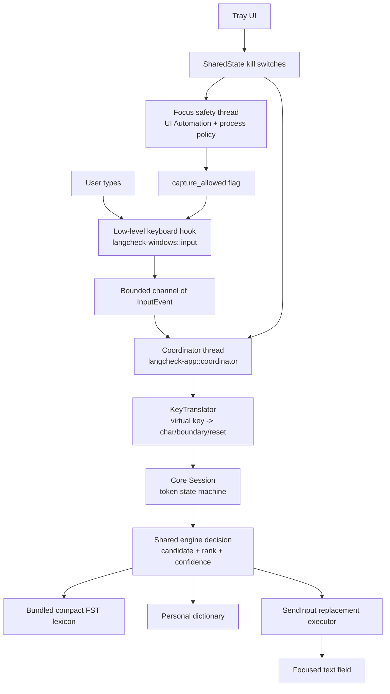
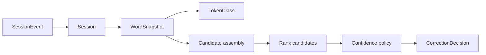
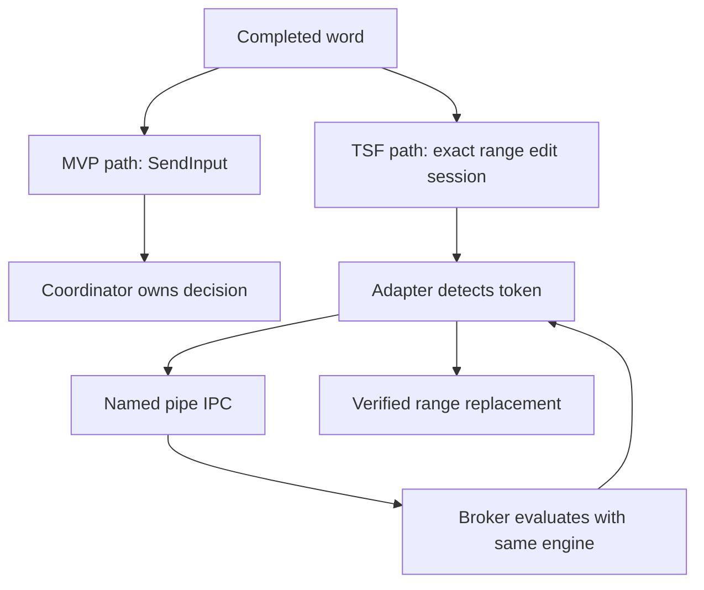

# LangCheck Codebase Guide

This document explains the LangCheck repository from top to bottom: what the
project is trying to do, which crate owns which responsibility, how a typed key
turns into a correction, and where to look when you want to change behavior.

It is written for someone reading the codebase for the first time.

## Table Of Contents

- [What LangCheck Is](#what-langcheck-is)
- [Core Design Rules](#core-design-rules)
- [Repository Map](#repository-map)
- [Runtime Architecture](#runtime-architecture)
- [End-To-End Correction Flow](#end-to-end-correction-flow)
- [Crate By Crate](#crate-by-crate)
- [Important Data Types](#important-data-types)
- [Persistence And User State](#persistence-and-user-state)
- [TSF Adapter Path](#tsf-adapter-path)
- [Security And Privacy Model](#security-and-privacy-model)
- [Testing And Quality Gates](#testing-and-quality-gates)
- [Packaging And Release](#packaging-and-release)
- [How To Read The Code In Order](#how-to-read-the-code-in-order)
- [Where To Make Common Changes](#where-to-make-common-changes)
- [Current Caveats To Be Aware Of](#current-caveats-to-be-aware-of)

## What LangCheck Is

LangCheck is a Windows-first spelling autocorrect utility. It runs locally in the
background, watches physical keyboard input only in fields it believes are safe
prose fields, and applies conservative spelling corrections after a word boundary
such as a space or period.

The important idea is that LangCheck is not a cloud grammar tool. It is designed
around strict local-only and privacy rules:

- No network calls.
- No telemetry.
- No crash upload.
- No typing history saved to disk.
- No correction in password fields, terminals, code editors, elevated windows, or
  unknown controls.
- No Windows service and no normal runtime elevation.

The project is a Rust workspace. Each crate has a narrow job:

- `langcheck-core`: pure correction logic.
- `langcheck-lexicon`: offline dictionary lookup.
- `langcheck-windows`: Win32/UI Automation/tray/startup integration.
- `langcheck-app`: the actual `langcheck.exe` broker process.
- `langcheck-ipc`: named-pipe transport for broker <-> TSF adapter.
- `langcheck-tsf`: optional in-process COM text service for richer editors.
- `langcheck-bench`: benchmark placeholder/harness crate.
- `tools/dictionary-compiler`: developer tool for building the bundled dictionary.

## Core Design Rules

These rules explain many of the codebase's decisions.

### 1. The Core Engine Is Pure

The correction engine in [`crates/langcheck-core`](../crates/langcheck-core) has
no Windows APIs, no filesystem layout, no concrete dictionary backend, and no
unsafe code. It accepts already-translated events and dictionary candidates, then
returns a decision.

That keeps the high-value logic testable on every platform.

### 2. Windows Risk Is Isolated

Windows APIs are isolated under
[`crates/langcheck-windows`](../crates/langcheck-windows),
[`crates/langcheck-ipc`](../crates/langcheck-ipc), and
[`crates/langcheck-tsf`](../crates/langcheck-tsf).

Those crates use `unsafe` where Win32/COM requires it, but they enforce
documented unsafe blocks with `#![deny(clippy::undocumented_unsafe_blocks)]`.

### 3. The Keyboard Hook Must Stay Tiny

The low-level keyboard hook is latency-sensitive and privacy-sensitive. The hook
callback does not run the dictionary, does not call UI Automation, does not log
keys, and does not allocate. It only:

1. Checks whether capture is currently allowed.
2. Ignores LangCheck's own injected events.
3. Copies a small key event into a bounded channel.
4. Drops events if the queue is full.

### 4. Fail Closed Before Capture

If a field cannot be positively identified as safe prose, capture stays disabled.
This is stronger than "capture everything and decide later." In unsafe contexts,
the core engine never sees the input at all.

### 5. Fail Open Inside Host Apps

The optional TSF adapter runs inside other applications. There the rule flips:
any error or uncertainty should leave the host app unchanged. The adapter should
not crash, block, or alter text unless all checks pass.

### 6. Precision Beats Recall

LangCheck is intentionally conservative. It would rather miss a typo than
incorrectly rewrite user text. That is why the engine has:

- strict token classification,
- known-word checks,
- ranking margins,
- deadlines,
- stale-input cancellation,
- focus rechecks,
- blocked pairs,
- immediate undo.

## Repository Map

Top-level files and folders:

| Path | Purpose |
|---|---|
| [`Cargo.toml`](../Cargo.toml) | Rust workspace manifest and release profile. |
| [`Cargo.lock`](../Cargo.lock) | Locked dependency versions. |
| [`README.md`](../README.md) | High-level project overview and commands. |
| [`blueprint.md`](../blueprint.md) | Long-form product/architecture plan and status. |
| [`SECURITY.md`](../SECURITY.md) | Security posture and reporting guidance. |
| [`deny.toml`](../deny.toml) | `cargo-deny` policy for licenses, sources, and banned crates. |
| [`rust-toolchain.toml`](../rust-toolchain.toml) | Pinned Rust toolchain. |
| [`rustfmt.toml`](../rustfmt.toml) | Formatting rules. |
| [`.github/workflows/ci.yml`](../.github/workflows/ci.yml) | CI gates. |
| [`crates/`](../crates) | Main Rust crates. |
| [`tools/`](../tools) | Developer/build tools. |
| [`docs/`](../docs) | Architecture, compatibility, privacy, threat model, ADRs. |
| [`packaging/`](../packaging) | Windows install/package scripts. |
| [`tests/`](../tests) | External test assets and harness notes. |
| [`scripts/offline-audit.ps1`](../scripts/offline-audit.ps1) | Source audit for networking/telemetry primitives. |

Workspace members from the root manifest:

```toml
members = [
    "crates/langcheck-core",
    "crates/langcheck-lexicon",
    "crates/langcheck-ipc",
    "crates/langcheck-windows",
    "crates/langcheck-app",
    "crates/langcheck-bench",
    "crates/langcheck-tsf",
    "tools/dictionary-compiler",
]
```

## Runtime Architecture

At runtime, the main process is `langcheck.exe`, implemented by
[`crates/langcheck-app`](../crates/langcheck-app). In background mode it creates a
few cooperating pieces:



The key threads/process components are:

| Component | Where | Job |
|---|---|---|
| Main broker process | `langcheck-app/src/main.rs` | Parses CLI modes and starts the runtime. |
| Input hook thread | `langcheck-windows/src/input/mod.rs` | Captures allowed physical key events into a bounded queue. |
| Focus thread | `langcheck-app/src/main.rs` + `langcheck-windows/src/focus/mod.rs` | Classifies the focused UI element and toggles capture. |
| Coordinator thread | `langcheck-app/src/coordinator.rs` | Owns session state, evaluates words, applies corrections. |
| Tray message loop | `langcheck-windows/src/tray/mod.rs` | Menu for enable/pause/settings/exit. |
| TSF broker thread | `langcheck-app/src/tsf_broker.rs` | Answers optional TSF adapter requests over IPC. |
| TSF adapter DLL | `langcheck-tsf/src/lib.rs` | Optional COM text service loaded into compatible host apps. |

## End-To-End Correction Flow

This is the main path for the MVP `SendInput` correction mechanism.

### 1. Focus Safety Decides Whether Capture Is Allowed

The focus thread repeatedly asks UI Automation about the currently focused
control. It reads metadata such as control type, enabled state, and password
state, but not field contents.

Relevant files:

- [`crates/langcheck-windows/src/focus/mod.rs`](../crates/langcheck-windows/src/focus/mod.rs)
- [`crates/langcheck-windows/src/policy.rs`](../crates/langcheck-windows/src/policy.rs)
- [`crates/langcheck-app/src/main.rs`](../crates/langcheck-app/src/main.rs)

The focus decision is conservative:

- Password fields are sensitive.
- Disabled/read-only/non-text fields are non-prose.
- Unknown control types fail closed.
- Excluded foreground processes fail closed.

The focus thread then sets the global `capture_allowed` flag.

### 2. The Keyboard Hook Captures Only When Allowed

The hook lives in:

- [`crates/langcheck-windows/src/input/mod.rs`](../crates/langcheck-windows/src/input/mod.rs)

If `capture_allowed` is false, the hook drops events immediately. If true, the
hook copies key metadata into `InputEvent`:

- generation number,
- timestamp,
- key down/up,
- virtual key,
- scan code,
- flags.

It does not store text. It does not translate keys into words. It does not call
the dictionary.

### 3. The Coordinator Translates Key Events

The coordinator uses:

- [`crates/langcheck-windows/src/input/translate.rs`](../crates/langcheck-windows/src/input/translate.rs)

`KeyTranslator` turns key events into core session events:

- `Char('a')`
- `Boundary(Boundary::Space)`
- `Backspace`
- `Reset(ResetReason::Navigation)`
- `Ignore`

Translation is English-layout MVP logic. Unknown keys, shortcuts, navigation,
newlines, deletion, shifted non-prose punctuation, dead-key-like cases, and IME
composition reset the session rather than guessing.

### 4. The Core Session Builds A Word

The session lives in:

- [`crates/langcheck-core/src/session.rs`](../crates/langcheck-core/src/session.rs)
- [`crates/langcheck-core/src/token.rs`](../crates/langcheck-core/src/token.rs)

The session stores only the active word being typed. It is bounded by
`SessionConfig::max_token_chars`, defaulting to 32 characters.

When a boundary arrives, the session emits:

```rust
SessionOutcome::Completed {
    word: WordSnapshot,
    boundary: Boundary,
}
```

`WordSnapshot` includes:

- focused window/field id,
- input generation,
- token version,
- original text,
- normalized lookup text,
- case pattern,
- token class.

### 5. The Coordinator Runs Final Commit Gates

Before doing expensive work or replacement, the coordinator checks:

- LangCheck is enabled.
- LangCheck is not paused.
- The token is eligible.
- Capture is still allowed.
- Focus did not change.
- Input generation is still fresh.
- The TSF adapter is not currently handling the same window.

Relevant file:

- [`crates/langcheck-app/src/coordinator.rs`](../crates/langcheck-app/src/coordinator.rs)

This protects against stale corrections, such as when the user typed a word,
pressed space, and immediately continued typing. If newer physical input has
arrived, the correction is cancelled.

### 6. The Engine Assembles Candidates

The shared engine entry point is:

- [`crates/langcheck-app/src/engine.rs`](../crates/langcheck-app/src/engine.rs)

It uses:

- the production lexicon,
- the personal dictionary,
- built-in typo rules,
- rank weights,
- confidence policy.

The core candidate logic lives in:

- [`crates/langcheck-core/src/candidate.rs`](../crates/langcheck-core/src/candidate.rs)

Candidate sources are:

- `Lexicon`: dictionary edit-distance search.
- `CommonTypoRule`: curated built-in typo table.
- `UserPair`: user-forced replacement pair.

### 7. The Lexicon Searches The Offline Dictionary

The lexicon layer lives in:

- [`crates/langcheck-lexicon/src/lib.rs`](../crates/langcheck-lexicon/src/lib.rs)
- [`crates/langcheck-lexicon/src/compact_fst.rs`](../crates/langcheck-lexicon/src/compact_fst.rs)

The production dictionary is a compact finite-state transducer embedded into the
binary:

- [`crates/langcheck-lexicon/dictionaries/en-US.fst`](../crates/langcheck-lexicon/dictionaries/en-US.fst)
- [`crates/langcheck-lexicon/dictionaries/en-US.meta.json`](../crates/langcheck-lexicon/dictionaries/en-US.meta.json)

Candidate search is bounded:

- max edit distance 1 for short words,
- max edit distance 2 for words length >= 6,
- raw match cap,
- result cap,
- optional deadline.

### 8. Ranking Chooses The Best Candidate

Ranking lives in:

- [`crates/langcheck-core/src/rank.rs`](../crates/langcheck-core/src/rank.rs)

It computes a score where lower is better. Inputs include:

- edit distance,
- word frequency,
- curated-rule bonus,
- user-rule bonus,
- keyboard-adjacent substitution bonus,
- casing compatibility penalty.

Ranking is deterministic. Ties are broken alphabetically.

### 9. Confidence Decides Whether To Correct

Confidence policy lives in:

- [`crates/langcheck-core/src/confidence.rs`](../crates/langcheck-core/src/confidence.rs)

Possible outcomes:

| Decision | Meaning |
|---|---|
| `Known` | The original word is already known; leave it alone. |
| `Ignore(reason)` | No safe correction. |
| `Suggest { ... }` | There is a plausible candidate, but not safe to autocorrect. |
| `AutoCorrect { ... }` | Safe enough to automatically replace. |

The default policy has:

- max autocorrect score,
- max suggestion score,
- minimum margin between best and second-best candidate.

This margin is what prevents ambiguous typos like `cas` from being rewritten when
several words are similarly plausible.

### 10. Replacement Uses SendInput

Replacement lives in:

- [`crates/langcheck-windows/src/replace/mod.rs`](../crates/langcheck-windows/src/replace/mod.rs)

The replacement plan erases:

```text
original + boundary
```

then types:

```text
replacement + boundary
```

For example:

```text
teh<space> -> backspace x4 -> the<space>
```

Important replacement safety rules:

- No clipboard.
- No retry after partial insertion.
- Each injected event gets `LANGCHECK_INJECTED_MARKER` so the hook ignores it.
- Higher-integrity windows are skipped instead of bypassing UIPI.
- Non-ASCII replacement is currently rejected in the MVP replacement path.

### 11. Immediate Undo Is Recorded

Undo state lives in:

- [`crates/langcheck-core/src/undo.rs`](../crates/langcheck-core/src/undo.rs)

After a correction is applied, the coordinator records one pending correction. If
the next relevant physical input is Backspace in the same focus within the undo
window, the correction is reversed.

The first undo restores the original. Repeated undo of the same pair suppresses
that pair for the current session. Permanent blocking lives in the personal
dictionary files.

## Crate By Crate

### `crates/langcheck-core`

Purpose: platform-independent correction logic.

Key rule: no Windows APIs and no unsafe code.

Files:

| File | What It Does |
|---|---|
| [`src/lib.rs`](../crates/langcheck-core/src/lib.rs) | Module declarations and public re-exports. |
| [`src/token.rs`](../crates/langcheck-core/src/token.rs) | Active token buffer, case detection, case restoration. |
| [`src/classify.rs`](../crates/langcheck-core/src/classify.rs) | Token classification and lookup normalization. |
| [`src/session.rs`](../crates/langcheck-core/src/session.rs) | Typing-session state machine. |
| [`src/candidate.rs`](../crates/langcheck-core/src/candidate.rs) | Built-in typo rules and candidate merging. |
| [`src/rank.rs`](../crates/langcheck-core/src/rank.rs) | Deterministic candidate scoring. |
| [`src/confidence.rs`](../crates/langcheck-core/src/confidence.rs) | Known/ignore/suggest/autocorrect decision policy. |
| [`src/undo.rs`](../crates/langcheck-core/src/undo.rs) | Immediate undo state machine. |
| [`src/ipc.rs`](../crates/langcheck-core/src/ipc.rs) | Pure IPC request/response types and byte encoding. |
| [`tests/corpus.rs`](../crates/langcheck-core/tests/corpus.rs) | Corpus-level precision behavior test. |

How the core pipeline fits together:



Important types:

- `Boundary`: safe punctuation/space boundaries.
- `ResetReason`: why the current typing session is discarded.
- `SessionEvent`: abstract input consumed by the core.
- `SessionOutcome`: result after applying an event.
- `WordSnapshot`: immutable token snapshot used for evaluation.
- `CandidateWord`: possible replacement.
- `CorrectionDecision`: final decision.
- `PendingCorrection`: undoable correction.

### `crates/langcheck-lexicon`

Purpose: offline dictionary lookup behind a trait.

Key rule: the engine never depends directly on a concrete dictionary backend.

Files:

| File | What It Does |
|---|---|
| [`src/lib.rs`](../crates/langcheck-lexicon/src/lib.rs) | `LexiconProvider` trait, candidate/error types, bounded Levenshtein helper. |
| [`src/compact_fst.rs`](../crates/langcheck-lexicon/src/compact_fst.rs) | Production compact FST dictionary backend. |
| [`src/personal.rs`](../crates/langcheck-lexicon/src/personal.rs) | User words, forced pairs, blocked pairs. |
| [`src/fake.rs`](../crates/langcheck-lexicon/src/fake.rs) | Deterministic test lexicon. |
| [`src/windows_spell.rs`](../crates/langcheck-lexicon/src/windows_spell.rs) | Rejected Windows Spell API backend, feature-gated for developer benchmarking only. |
| [`src/prototype_en_us.txt`](../crates/langcheck-lexicon/src/prototype_en_us.txt) | Small embedded prototype word list for tests/dev. |
| [`data/en-US.wordfreq.txt`](../crates/langcheck-lexicon/data/en-US.wordfreq.txt) | Source word-frequency data for production dictionary. |
| [`dictionaries/en-US.fst`](../crates/langcheck-lexicon/dictionaries/en-US.fst) | Compiled production FST dictionary. |
| [`dictionaries/en-US.meta.json`](../crates/langcheck-lexicon/dictionaries/en-US.meta.json) | Dictionary metadata. |

The public trait is:

```rust
pub trait LexiconProvider: Send + Sync {
    fn language(&self) -> LanguageTag;
    fn contains(&self, language: LanguageTag, word: &str) -> bool;
    fn candidates(
        &self,
        language: LanguageTag,
        word: &str,
        limit: usize,
        deadline: Option<Instant>,
    ) -> Result<CandidateList, LexiconError>;
}
```

This is why the engine can be tested with `FakeLexicon` and shipped with
`CompactFstLexicon`.

### `crates/langcheck-windows`

Purpose: all Windows-specific runtime integration except the app's high-level
coordination.

Key rule: this crate is the Win32/UIA boundary. Unsafe code is allowed only with
documented safety comments.

Files:

| File | What It Does |
|---|---|
| [`src/lib.rs`](../crates/langcheck-windows/src/lib.rs) | Module exports and injected-input marker. |
| [`src/input/mod.rs`](../crates/langcheck-windows/src/input/mod.rs) | Low-level keyboard hook and bounded event capture. |
| [`src/input/translate.rs`](../crates/langcheck-windows/src/input/translate.rs) | Virtual-key to core input translation. |
| [`src/focus/mod.rs`](../crates/langcheck-windows/src/focus/mod.rs) | UI Automation focus classification. |
| [`src/policy.rs`](../crates/langcheck-windows/src/policy.rs) | Default process exclusion policy. |
| [`src/replace/mod.rs`](../crates/langcheck-windows/src/replace/mod.rs) | `SendInput` correction and undo replacement. |
| [`src/integrity.rs`](../crates/langcheck-windows/src/integrity.rs) | Process integrity-level checks for UIPI. |
| [`src/startup/mod.rs`](../crates/langcheck-windows/src/startup/mod.rs) | HKCU start-at-login and single-instance mutex. |
| [`src/tray/mod.rs`](../crates/langcheck-windows/src/tray/mod.rs) | Native Win32 tray icon and context menu. |
| [`src/tsf.rs`](../crates/langcheck-windows/src/tsf.rs) | Loading/registering/unregistering the TSF adapter DLL. |

Main ideas:

- `input` captures physical key events only when `capture_allowed` is true.
- `focus` decides when `capture_allowed` should be true.
- `policy` excludes risky app categories by process name.
- `integrity` prevents trying to inject into elevated targets.
- `replace` performs correction using marked synthetic Unicode key events.
- `startup` handles per-user startup registration without creating a service.
- `tray` gives the user runtime control.
- `tsf` is only a loader/registration wrapper for the adapter DLL.

### `crates/langcheck-app`

Purpose: the resident broker executable, `langcheck.exe`.

Files:

| File | What It Does |
|---|---|
| [`src/main.rs`](../crates/langcheck-app/src/main.rs) | CLI entry point and runtime startup. |
| [`src/coordinator.rs`](../crates/langcheck-app/src/coordinator.rs) | Main correction loop and commit safety gates. |
| [`src/engine.rs`](../crates/langcheck-app/src/engine.rs) | Shared decision logic used by MVP path and TSF broker. |
| [`src/config.rs`](../crates/langcheck-app/src/config.rs) | Config schema, defaults, validation, TOML serialization. |
| [`src/persistence.rs`](../crates/langcheck-app/src/persistence.rs) | `%LOCALAPPDATA%\LangCheck` paths and atomic config writes. |
| [`src/diagnostics.rs`](../crates/langcheck-app/src/diagnostics.rs) | Redacted in-memory counters. |
| [`src/tsf_broker.rs`](../crates/langcheck-app/src/tsf_broker.rs) | Same-user IPC server for TSF adapter evaluation requests. |
| [`build.rs`](../crates/langcheck-app/build.rs) | Embeds the app icon as Win32 resource id 1 on Windows. |
| [`assets/langcheck.ico`](../crates/langcheck-app/assets/langcheck.ico) | Application/tray icon asset. |

Important CLI modes in `main.rs`:

| Mode | Purpose |
|---|---|
| `--background` | Start resident tray app, input hook, focus thread, coordinator, TSF broker. |
| `--run` | Console autocorrect mode with live metrics. |
| `--spike` | Input/focus measurement harness. |
| `--replace-demo` | Manual replacement/integrity demo. |
| `--status` | Print persisted config and startup status. |
| `--register-startup` / `--unregister-startup` | Toggle HKCU start-at-login. |
| `--register-tsf` / `--unregister-tsf` | Register/remove optional TSF adapter. |
| `--tsf-enable` / `--tsf-disable` | Toggle TSF correction kill switch. |
| `--broker-serve` | Run only TSF IPC broker in foreground. |
| `--broker-eval WORD` | Ask running broker how it would handle a word. |
| `--tsf-selftest` | Load adapter DLL and check IPC path. |
| `--tsf-comtest` | Load adapter DLL and check COM activation path. |
| `--reset` | Delete all LangCheck state. |

`coordinator.rs` is the most important app file. It owns:

- `Session`
- `KeyTranslator`
- lexicon provider
- personal dictionary
- replacement executor
- undo state
- session blocklist
- metrics
- shared kill switches

### `crates/langcheck-ipc`

Purpose: same-user, local-only named pipe transport between broker and TSF
adapter.

Files:

| File | What It Does |
|---|---|
| [`src/lib.rs`](../crates/langcheck-ipc/src/lib.rs) | Pipe name, DACL, server, client request function. |

The protocol bytes live in `langcheck-core/src/ipc.rs`; this crate only moves
those bytes over a Windows named pipe.

Security properties:

- Pipe name includes current user SID.
- DACL grants access only to current user and SYSTEM.
- `PIPE_REJECT_REMOTE_CLIENTS` rejects remote clients.
- Fixed buffer size.
- One request/response per connection.

### `crates/langcheck-tsf`

Purpose: optional Text Services Framework precision adapter.

Files:

| File | What It Does |
|---|---|
| [`src/lib.rs`](../crates/langcheck-tsf/src/lib.rs) | COM text service, TSF sinks, IPC client, registration exports. |

This crate builds as:

```toml
crate-type = ["cdylib", "rlib"]
```

The DLL is loaded by compatible host apps after registration as a TSF text
service.

Important exports:

| Export | Purpose |
|---|---|
| `DllGetClassObject` | COM class factory entry point. |
| `DllCanUnloadNow` | COM unload check. |
| `DllRegisterServer` | Machine-wide COM + TSF registration. |
| `DllUnregisterServer` | Remove COM + TSF registration. |
| `LangCheckIpcSelfTest` | Diagnostic: verify adapter can reach broker. |
| `LangCheckComSelfTest` | Diagnostic: verify COM activation/focus sink path. |

Important internal pieces:

- `TextService`: implements `ITfTextInputProcessor`.
- `ThreadMgrSink`: observes TSF focus changes.
- `EditSink`: observes text edits in the focused context.
- `detect_token`: pure trailing-token detection.
- `ask_broker`: sends `Request::Evaluate` to the broker.
- `notify_broker_active`: sends the `Request::Active` focus beacon on focus.
- `ReplaceSession`: applies a verified replacement range.

The TSF adapter has no dictionary and no correction policy. It asks the broker.

### `tools/dictionary-compiler`

Purpose: compile the source word-frequency list into the production FST
dictionary.

Files:

| File | What It Does |
|---|---|
| [`src/main.rs`](../tools/dictionary-compiler/src/main.rs) | Reads word/count list, builds FST, writes dictionary bytes + metadata. |

Default command:

```powershell
cargo run -p dictionary-compiler
```

Default input:

```text
crates/langcheck-lexicon/data/en-US.wordfreq.txt
```

Default outputs:

```text
crates/langcheck-lexicon/dictionaries/en-US.fst
crates/langcheck-lexicon/dictionaries/en-US.meta.json
```

### `crates/langcheck-bench`

Purpose: placeholder/harness crate for benchmarks.

Current file:

- [`crates/langcheck-bench/src/lib.rs`](../crates/langcheck-bench/src/lib.rs)

It currently documents benchmark intent but does not contain substantial benchmark
logic.

## Important Data Types

### `InputEvent`

Defined in:

- [`crates/langcheck-windows/src/input/mod.rs`](../crates/langcheck-windows/src/input/mod.rs)

Represents one copied keyboard event from the hook:

- generation,
- timestamp,
- key kind,
- virtual key,
- scan code,
- flags.

It intentionally contains no text string.

### `Translated`

Defined in:

- [`crates/langcheck-windows/src/input/translate.rs`](../crates/langcheck-windows/src/input/translate.rs)

Bridge type between Windows virtual keys and the core session:

- `Char(char)`
- `Boundary(Boundary)`
- `Backspace`
- `Reset(ResetReason)`
- `Ignore`

### `SessionEvent`

Defined in:

- [`crates/langcheck-core/src/session.rs`](../crates/langcheck-core/src/session.rs)

The platform-independent input event consumed by the core session.

### `WordSnapshot`

Defined in:

- [`crates/langcheck-core/src/session.rs`](../crates/langcheck-core/src/session.rs)

Immutable snapshot of a completed or in-progress token:

- exact text,
- normalized text,
- case pattern,
- class,
- focus id,
- generation,
- token version.

### `TokenClass`

Defined in:

- [`crates/langcheck-core/src/classify.rs`](../crates/langcheck-core/src/classify.rs)

Classifies tokens structurally:

- `NaturalWord`
- `KnownPersonalWord`
- `EmailOrUrl`
- `Path`
- `CodeOrIdentifier`
- `NumericOrMixed`
- `UnsupportedUnicode`
- `TooShort`
- `TooLong`

Only `NaturalWord` is currently eligible for automatic correction.

### `CorrectionDecision`

Defined in:

- [`crates/langcheck-core/src/confidence.rs`](../crates/langcheck-core/src/confidence.rs)

The engine's final answer:

- `Known`
- `Ignore`
- `Suggest`
- `AutoCorrect`

### `ReplacementPlan`

Defined in:

- [`crates/langcheck-windows/src/replace/mod.rs`](../crates/langcheck-windows/src/replace/mod.rs)

Describes the exact correction to apply:

- focus id,
- expected generation,
- original,
- replacement,
- boundary.

### `SharedState`

Defined in:

- [`crates/langcheck-app/src/coordinator.rs`](../crates/langcheck-app/src/coordinator.rs)

Shared atomics used across threads:

- focused window id,
- enabled flag,
- paused flag,
- TSF enabled flag,
- TSF active window and timestamp,
- shutdown flag.

### `Metrics`

Defined in:

- [`crates/langcheck-app/src/diagnostics.rs`](../crates/langcheck-app/src/diagnostics.rs)

Redacted counters only. No typed text.

## Persistence And User State

Runtime state lives under:

```text
%LOCALAPPDATA%\LangCheck
```

The app persistence layer is:

- [`crates/langcheck-app/src/persistence.rs`](../crates/langcheck-app/src/persistence.rs)

Main paths:

| Path | Purpose |
|---|---|
| `%LOCALAPPDATA%\LangCheck\config.toml` | User config. |
| `%LOCALAPPDATA%\LangCheck\state\user_words.txt` | User-approved personal words. |
| `%LOCALAPPDATA%\LangCheck\state\autocorrect.tsv` | User-forced correction pairs. |
| `%LOCALAPPDATA%\LangCheck\state\blocked_pairs.tsv` | User-blocked correction pairs. |

Config schema lives in:

- [`crates/langcheck-app/src/config.rs`](../crates/langcheck-app/src/config.rs)

Personal dictionary logic lives in:

- [`crates/langcheck-lexicon/src/personal.rs`](../crates/langcheck-lexicon/src/personal.rs)

Important persistence rules:

- Missing/corrupt config falls back to defaults.
- Config values are validated and clamped.
- `retain_typing_history` is forced to false.
- Writes use temporary sibling files and rename.
- Personal dictionary files are human-inspectable plain text/TSV.

## TSF Adapter Path

The TSF adapter exists because `SendInput` is not reliable in all rich/web/Electron
editors. TSF can replace an exact text range instead of simulating backspaces and
typing.

There are two correction paths:



Important point: both paths use the same broker decision logic. The TSF adapter
does not hold language logic.

Files involved:

| Path | Purpose |
|---|---|
| [`crates/langcheck-tsf/src/lib.rs`](../crates/langcheck-tsf/src/lib.rs) | Adapter DLL, COM/TSF sinks, range replacement. |
| [`crates/langcheck-ipc/src/lib.rs`](../crates/langcheck-ipc/src/lib.rs) | Named-pipe transport. |
| [`crates/langcheck-core/src/ipc.rs`](../crates/langcheck-core/src/ipc.rs) | Request/response protocol. |
| [`crates/langcheck-app/src/tsf_broker.rs`](../crates/langcheck-app/src/tsf_broker.rs) | Broker-side IPC server. |
| [`crates/langcheck-windows/src/tsf.rs`](../crates/langcheck-windows/src/tsf.rs) | Load/register/unregister adapter DLL. |

Coordination between MVP and TSF:

- The moment the adapter gains focus it sends a `Request::Active` **focus beacon**
  (before the first keystroke). The broker records TSF activity for the foreground
  window immediately, so the MVP keystroke path stands down *before* it can fire.
- Every subsequent `Request::Evaluate` refreshes that activity timestamp.
- The MVP coordinator defers in that same window for `TSF_DEFER_WINDOW_MS`. The
  window is focus-scoped, so a stale value never suppresses correction in a
  *different* (non-TSF) app — the keystroke path still works everywhere else.
- Together this stops both paths from correcting the same word (the beacon closes
  the first-word race the per-word deferral alone could not).

## Security And Privacy Model

Security and privacy are not side docs only; they are encoded in the shape of the
runtime.

### No Network

Enforced by:

- no networking code in source,
- offline audit script,
- `cargo-deny` banned networking/telemetry crates,
- no updater.

Relevant files:

- [`scripts/offline-audit.ps1`](../scripts/offline-audit.ps1)
- [`deny.toml`](../deny.toml)

### No Typing History

Enforced by:

- hook captures only when safe,
- no raw text logging,
- metrics are counters only,
- config forces `retain_typing_history = false`,
- persistence stores only approved settings/dictionary entries.

Relevant files:

- [`crates/langcheck-app/src/config.rs`](../crates/langcheck-app/src/config.rs)
- [`crates/langcheck-app/src/diagnostics.rs`](../crates/langcheck-app/src/diagnostics.rs)
- [`crates/langcheck-lexicon/src/personal.rs`](../crates/langcheck-lexicon/src/personal.rs)

### Sensitive Fields Are Inert

Enforced by:

- UIA password field check,
- unknown fields fail closed,
- excluded process list,
- capture disabled before hook queues events.

Relevant files:

- [`crates/langcheck-windows/src/focus/mod.rs`](../crates/langcheck-windows/src/focus/mod.rs)
- [`crates/langcheck-windows/src/policy.rs`](../crates/langcheck-windows/src/policy.rs)
- [`crates/langcheck-windows/src/input/mod.rs`](../crates/langcheck-windows/src/input/mod.rs)

### No UIPI Bypass

LangCheck checks target integrity level before injecting input. Higher-integrity
targets are skipped.

Relevant files:

- [`crates/langcheck-windows/src/integrity.rs`](../crates/langcheck-windows/src/integrity.rs)
- [`crates/langcheck-windows/src/replace/mod.rs`](../crates/langcheck-windows/src/replace/mod.rs)

### TSF Registration Is Opt-In

The TSF adapter is registered machine-wide, so it requires elevation. That is the
only expected elevation path, and it is explicit.

Relevant files:

- [`crates/langcheck-app/src/main.rs`](../crates/langcheck-app/src/main.rs)
- [`crates/langcheck-windows/src/tsf.rs`](../crates/langcheck-windows/src/tsf.rs)
- [`crates/langcheck-tsf/src/lib.rs`](../crates/langcheck-tsf/src/lib.rs)

## Testing And Quality Gates

The normal local gates are:

```powershell
cargo fmt --all -- --check
cargo clippy --workspace --all-targets --locked -- -D warnings
cargo test --workspace --all-targets --locked
cargo test --workspace --doc --locked
cargo build --workspace --release --locked
pwsh scripts\offline-audit.ps1
cargo deny check
```

CI runs these categories:

- format,
- clippy,
- tests,
- release build,
- Linux build/test of platform-independent crates,
- dependency audit,
- SBOM generation,
- offline invariant audit.

Important tests:

| Area | Where |
|---|---|
| Token/case/session invariants | `langcheck-core/src/*.rs` tests. |
| Corpus precision gate | [`crates/langcheck-core/tests/corpus.rs`](../crates/langcheck-core/tests/corpus.rs). |
| Production lexicon load/candidates | `langcheck-lexicon/src/compact_fst.rs` tests. |
| IPC protocol | `langcheck-core/src/ipc.rs` tests. |
| Real named-pipe round trip | `langcheck-ipc/src/lib.rs` tests. |
| Windows pure logic | `langcheck-windows/src/*` tests. |
| Config/persistence | `langcheck-app/src/config.rs`, `persistence.rs` tests. |
| TSF pure token detection | `langcheck-tsf/src/lib.rs` tests. |

Manual gates are still important because UI Automation, hooks, TSF, tray behavior,
and `SendInput` behavior depend on real Windows desktop apps.

Manual verification docs:

- [`docs/compatibility.md`](compatibility.md)
- [`tests/windows-harness/README.md`](../tests/windows-harness/README.md)

## Packaging And Release

Packaging docs and scripts live under:

- [`packaging/README.md`](../packaging/README.md)
- [`packaging/install.ps1`](../packaging/install.ps1)
- [`packaging/uninstall.ps1`](../packaging/uninstall.ps1)
- [`packaging/package.ps1`](../packaging/package.ps1)

Packaging intent:

- per-user install under `%LOCALAPPDATA%\Programs\LangCheck`,
- no admin required for normal install,
- optional TSF registration prompts for elevation,
- app ships `langcheck.exe` and `langcheck_tsf.dll`,
- no updater,
- release zip assembled under `dist\`.

Release process summary:

1. Build release binaries.
2. Regenerate dictionary if source changed.
3. Run quality gates.
4. Sign `langcheck.exe` and `langcheck_tsf.dll`.
5. Generate SBOM/license notices.
6. Package release zip.
7. Test install/upgrade/uninstall on a clean machine.

## How To Read The Code In Order

If you are new, read in this order:

1. [`README.md`](../README.md) for the product summary.
2. [`docs/compatibility.md`](compatibility.md) for runtime behavior expectations.
3. [`crates/langcheck-core/src/session.rs`](../crates/langcheck-core/src/session.rs) to understand typed-word state.
4. [`crates/langcheck-core/src/confidence.rs`](../crates/langcheck-core/src/confidence.rs) to understand final decisions.
5. [`crates/langcheck-app/src/coordinator.rs`](../crates/langcheck-app/src/coordinator.rs) to see the end-to-end loop.
6. [`crates/langcheck-windows/src/input/mod.rs`](../crates/langcheck-windows/src/input/mod.rs) for capture.
7. [`crates/langcheck-windows/src/focus/mod.rs`](../crates/langcheck-windows/src/focus/mod.rs) for safety gating.
8. [`crates/langcheck-windows/src/replace/mod.rs`](../crates/langcheck-windows/src/replace/mod.rs) for replacement.
9. [`crates/langcheck-lexicon/src/compact_fst.rs`](../crates/langcheck-lexicon/src/compact_fst.rs) for dictionary search.
10. [`crates/langcheck-tsf/src/lib.rs`](../crates/langcheck-tsf/src/lib.rs) only after the MVP path is clear.

## Where To Make Common Changes

| Goal | Start Here |
|---|---|
| Add or change a built-in typo correction | [`crates/langcheck-core/src/candidate.rs`](../crates/langcheck-core/src/candidate.rs) |
| Tune autocorrect aggressiveness | [`crates/langcheck-core/src/confidence.rs`](../crates/langcheck-core/src/confidence.rs), [`rank.rs`](../crates/langcheck-core/src/rank.rs) |
| Change token eligibility | [`crates/langcheck-core/src/classify.rs`](../crates/langcheck-core/src/classify.rs) |
| Change safe boundaries | [`crates/langcheck-core/src/session.rs`](../crates/langcheck-core/src/session.rs), [`input/translate.rs`](../crates/langcheck-windows/src/input/translate.rs), [`langcheck-tsf/src/lib.rs`](../crates/langcheck-tsf/src/lib.rs) |
| Change keyboard translation | [`crates/langcheck-windows/src/input/translate.rs`](../crates/langcheck-windows/src/input/translate.rs) |
| Exclude more apps | [`crates/langcheck-windows/src/policy.rs`](../crates/langcheck-windows/src/policy.rs) |
| Improve focus safety | [`crates/langcheck-windows/src/focus/mod.rs`](../crates/langcheck-windows/src/focus/mod.rs) |
| Change replacement mechanics | [`crates/langcheck-windows/src/replace/mod.rs`](../crates/langcheck-windows/src/replace/mod.rs) |
| Add config options | [`crates/langcheck-app/src/config.rs`](../crates/langcheck-app/src/config.rs), then wire them through [`coordinator.rs`](../crates/langcheck-app/src/coordinator.rs) or [`main.rs`](../crates/langcheck-app/src/main.rs) |
| Change CLI modes | [`crates/langcheck-app/src/main.rs`](../crates/langcheck-app/src/main.rs) |
| Change tray menu behavior | [`crates/langcheck-windows/src/tray/mod.rs`](../crates/langcheck-windows/src/tray/mod.rs) |
| Change TSF registration | [`crates/langcheck-windows/src/tsf.rs`](../crates/langcheck-windows/src/tsf.rs), [`crates/langcheck-tsf/src/lib.rs`](../crates/langcheck-tsf/src/lib.rs) |
| Change IPC protocol | [`crates/langcheck-core/src/ipc.rs`](../crates/langcheck-core/src/ipc.rs), then update [`langcheck-ipc`](../crates/langcheck-ipc) and TSF broker/client call sites |
| Change dictionary source | [`crates/langcheck-lexicon/data/en-US.wordfreq.txt`](../crates/langcheck-lexicon/data/en-US.wordfreq.txt), then run `cargo run -p dictionary-compiler` |
| Change install/package behavior | [`packaging/`](../packaging) |

## Current Caveats To Be Aware Of

These are not the design intent; they are important observations about the current
checkout.

### `CorrectionMode::Suggest` Is Defined But Not Fully Wired

The config enum defines `Suggest`, but the startup path currently only treats
`Off` specially. That means `Suggest` mode may still behave like conservative
autocorrect unless additional coordinator logic is added.

Relevant files:

- [`crates/langcheck-app/src/config.rs`](../crates/langcheck-app/src/config.rs)
- [`crates/langcheck-app/src/main.rs`](../crates/langcheck-app/src/main.rs)
- [`crates/langcheck-app/src/coordinator.rs`](../crates/langcheck-app/src/coordinator.rs)

### Config Performance Knobs Are Not Fully Wired

`decision_deadline_ms` and `max_token_chars` exist in config, but the coordinator
currently uses a hardcoded decision deadline and `SessionConfig::default()`.

Relevant files:

- [`crates/langcheck-app/src/config.rs`](../crates/langcheck-app/src/config.rs)
- [`crates/langcheck-app/src/coordinator.rs`](../crates/langcheck-app/src/coordinator.rs)

### Some Windows Behavior Requires Manual Verification

The source contains strong safety structure, but UI Automation focus detection,
real `SendInput` replacement behavior, tray UI behavior, and TSF host behavior
must be verified in real Windows desktop applications.

Relevant docs:

- [`docs/compatibility.md`](compatibility.md)
- [`tests/windows-harness/README.md`](../tests/windows-harness/README.md)

